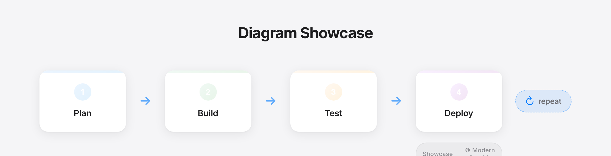

# Modern Graphics Generator

Build hero slides, insight cards, and diagrams from one CLI with clarity-first defaults.

## What You Can Build

| Insight Card | Key Insight Quote | Insight Story |
|---|---|---|
| [](examples/output/showcase/create-first/insight-card.png) | [](examples/output/showcase/create-first/key-insight-quote.png) | [](examples/output/showcase/create-first/insight-story.png) |

| Hero | Triptych Hero | Open Canvas Hero |
|---|---|---|
| [](examples/output/showcase/create-first/hero.png) | [](examples/output/showcase/hero-slides/05-triptych.png) | [](examples/output/showcase/hero-slides/02-open-canvas-flowchart.png) |

| Cycle Diagram | Timeline Diagram | Slide Cards |
|---|---|---|
| [](examples/output/showcase/diagram-types/01-cycle.png) | [](examples/output/showcase/diagram-types/03-timeline.png) | [](examples/output/showcase/diagram-types/07-slide-cards.png) |

Canonical showcase assets live in `examples/output/showcase/`.

## Quick Switch (Jobs To Be Done)

- [Use the package](#use-the-package-2-minutes)
- [Make graphics](#make-graphics-3-minutes)
- [Build a custom theme (font/colors)](#build-a-custom-theme-fontcolors-8-minutes)
- [Build a super custom hero](#build-a-super-custom-hero-10-minutes)
- [Call the CLI directly](#call-the-cli-directly-5-minutes)

## First Commands (Most Common Jobs)

### Make graphics (about 3 minutes)

```bash
modern-graphics create \
  --layout hero \
  --headline "Execution scales. Judgment does not." \
  --png \
  --output ./output/hero.png
```

Expected output: `./output/hero.png`.

### Build a custom theme (about 8 minutes)

```bash
python scripts/custom_template.py
```

Expected output: `dark_cycle_example.html`.

## Start Here

Install dependencies once:

```bash
pip install playwright pillow python-dotenv
playwright install chromium
```

Generate a first PNG:

```bash
modern-graphics create \
  --layout hero \
  --headline "Execution scales. Judgment does not." \
  --png \
  --output ./output/hero.png
```

Expected output: `./output/hero.png`.

Defaults (good for most first runs):
- `theme=corporate`
- `density=clarity`
- `crop-mode=safe`
- `padding-mode=minimal`

## Choose Your Path

### Use the package (2 minutes)

- Start here: [`docs/QUICKSTART.md`](docs/QUICKSTART.md)
- API surface: [`docs/API.md`](docs/API.md)

### Make graphics (3 minutes)

- Runnable examples: [`examples/README.md`](examples/README.md)
- Diagram/layout catalog: [`docs/DIAGRAM_TYPES.md`](docs/DIAGRAM_TYPES.md)
- Curated tracked outputs: `examples/output/showcase/`

### Build a custom theme (font/colors) (8 minutes)

- Theme and template customization: [`docs/ADVANCED.md#custom-templates`](docs/ADVANCED.md#custom-templates)
- Export/crop/padding tuning: [`docs/EXPORT.md`](docs/EXPORT.md)

### Build a super custom hero (10 minutes)

- Hero composition patterns: [`docs/HERO_SLIDES.md`](docs/HERO_SLIDES.md)
- Mermaid and SVG embedding: [`docs/MERMAID.md`](docs/MERMAID.md)
- SVG.js and freeform extension: [`docs/ADVANCED.md#svgjs-integration`](docs/ADVANCED.md#svgjs-integration)

### Call the CLI directly (5 minutes)

- Canonical command + recipes: [`docs/CREATE_COMMAND.md`](docs/CREATE_COMMAND.md)
- Migration from legacy commands: [`docs/MIGRATION.md`](docs/MIGRATION.md)
- Deprecation policy: [`docs/DEPRECATION_POLICY.md`](docs/DEPRECATION_POLICY.md)

Full docs map: [`docs/README.md`](docs/README.md)

## Contributing

- Contribution guide: [`docs/CONTRIBUTING.md`](docs/CONTRIBUTING.md)
- Strategy and overhaul context: [`docs/OVERHAUL_SPEC.md`](docs/OVERHAUL_SPEC.md)

## License

MIT License.
