# Modern Graphics Generator

> Build hero slides, story cards, and diagrams from prompts or structured data—one theme across every output. Designed for storytellers, marketing teams, and analysts who need branded visuals in minutes.

> **Theme demo note:** PNG thumbnails in `examples/output/theme-demo/*.png` are checked in, but the gallery `index.html` is generated locally. Run `python examples/generate_complete_theme_demo.py` before opening `examples/output/theme-demo/index.html`.

[**Jump to the theme demo →**](examples/output/theme-demo/index.html) *(PNG previews are versioned; run `python examples/generate_complete_theme_demo.py` to regenerate HTML locally.)*

## Why teams use it
- 🎨 **8 built-in themes** – apple, corporate, dark, warm, green, arcade, nike, operator-clarity-v2 – or create your own
- 📊 **15+ built-in layouts** – story slides, cycles, timelines, funnels, pyramids, grids, insight cards, and wireframes
- 💡 **Insight graphics workflow** – create wireframe → generate SVG → present as insight card or story
- ⚡ **CLI + Python API** – use `--theme apple` from command line or instantiate in code
- 🤖 **Prompt-ready workflows** – optional AI helpers for themes, decks, or article summaries
- 🧩 **Extensible** – write your own diagram modules or SVG.js mockups
- 🖼️ **Production exports** – high-res PNGs with automatic cropping

## Quick Navigation

- **[How Do I Get Started?](#how-do-i-get-started)** - Get your first graphic in 5 minutes
- **[How Do I Prompt Creatively?](#how-do-i-prompt-creatively)** - AI-powered generation techniques
- **[What Can You Create?](#what-can-you-create)** - See all diagram types and examples
- **[Insight Graphics Guide](#insight-graphics-guide)** - Create insight cards, pull quotes, and before/after stories
- **[Customization Guide](#customization-guide)** - Create custom themes and styles
- **[Examples & Showcase](#examples--showcase)** - Browse real examples
- **[Documentation](#documentation)** - Complete guides and API reference

## What Can You Create?

**Quick example:**
```python
from modern_graphics import generate_scheme_from_prompt

# Create theme from description
scheme = generate_scheme_from_prompt(
    "modern tech startup with bright cyan and coral colors"
)

# Apply to any graphic
html = generator.generate_modern_hero(...)
html = scheme.apply_to_html(html)  # Colors + fonts applied automatically
```

[View complete theme demo →](examples/output/theme-demo/index.html) | [Create Your Theme →](docs/ADVANCED.md#color-scheme-generator)

### Diagram Types

10+ built-in layouts cover everything from narrative story slides to comparison grids. Highlights:

- **Narrative slides:** story slides, editorial hero panels
- **Flow & journeys:** cycles, flywheels, funnels, pyramids, milestone timelines, roadmaps
- **Comparison & grids:** comparison cards, matrices, KPI or insight grids
- **Before/after stories:** transformation cards, makeover grids, KPI deltas
- **Insight graphics:** key insights, insight cards with SVG illustrations, insight stories with before/after comparisons
- **Post-it flow wireframes:** tilted sticky-note flows with multiple layout options (linear, zigzag, vertical, arc, outline, org chart, fishbone, mind map)
- **Mermaid diagrams:** flowcharts, Sankey, and sequence diagrams with theme support, embedded in heroes or insight cards

**Preview them:** PNG thumbnails live in `examples/output/showcase/diagram-types/` (tracked). For themed variants (funnel, pyramid, hero canvas cards, etc.), run `python examples/generate_complete_theme_demo.py` and open `examples/output/theme-demo/index.html`.

[Diagram reference →](docs/DIAGRAM_TYPES.md)

### Insight Graphics (New!)

Create compelling insight graphics for articles and presentations—from standalone pull quotes to full before/after comparison stories.

| Key Insight | Insight Card | Insight Story |
|-------------|--------------|---------------|
| 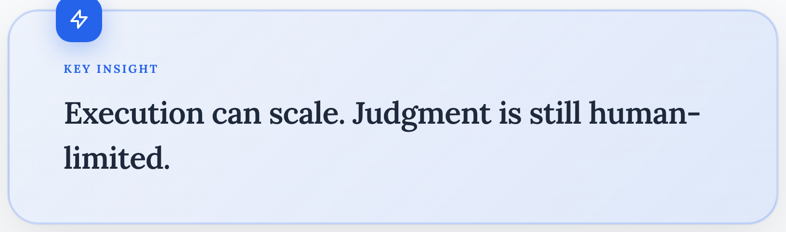 | 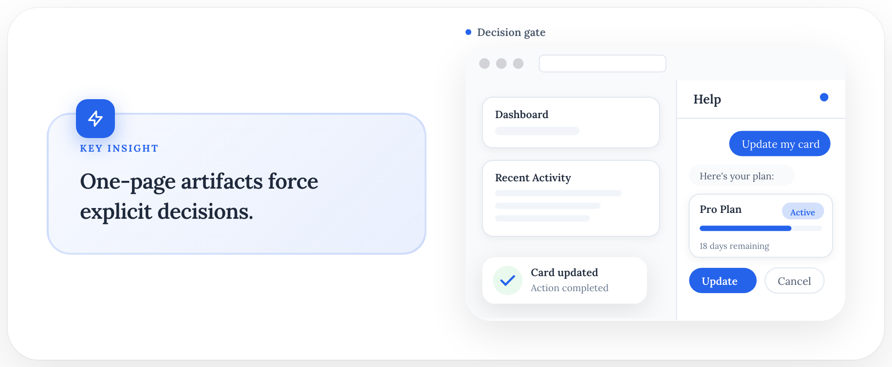 | 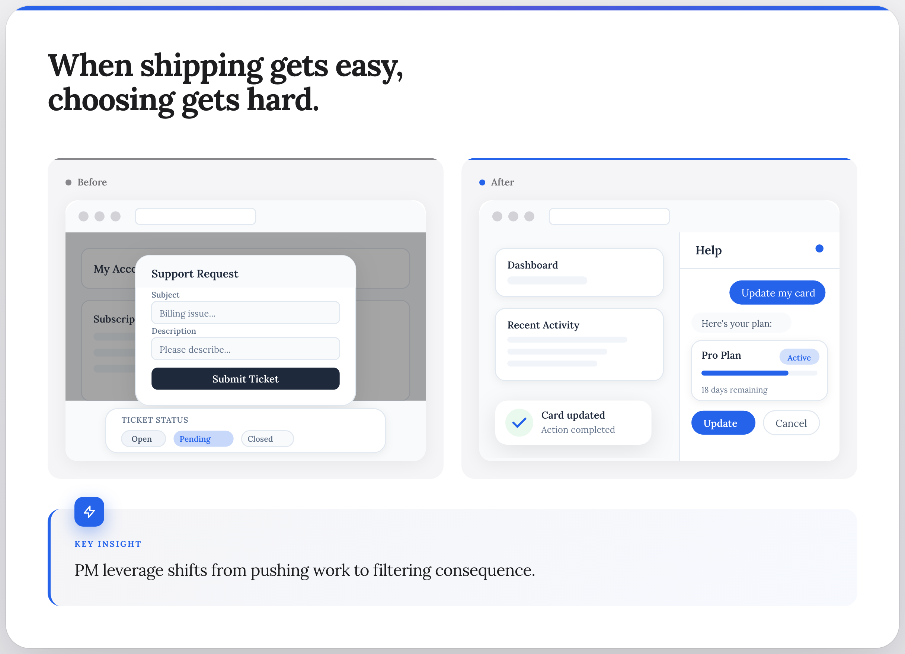 |
| Standalone pull quote with variants | Insight + SVG illustration | Full before/after with stats |

Rebuild these README preview assets with:
`python scripts/generate_readme_create_examples.py`

**The workflow:** Create wireframe → Generate SVG → Present as insight graphic

```python
from modern_graphics import ModernGraphicsGenerator, Attribution
from modern_graphics.diagrams.wireframe_svg import generate_after_wireframe_svg, WireframeSVGConfig
from modern_graphics.diagrams.insight import generate_insight_card

generator = ModernGraphicsGenerator("My Insight", Attribution())

# 1. Generate an SVG wireframe
svg = generate_after_wireframe_svg(WireframeSVGConfig(width=360, height=280))

# 2. Combine with insight in a card
html = generate_insight_card(
    generator,
    text="The chatbot isn't replacing <em>resolution</em>. It's replacing <em>waiting</em>.",
    svg_content=svg,
    svg_label="Inline control surface",
    variant="bold",
)

# 3. Export with tight cropping for inline use
generator.export_to_png(html, "insight-card.png", padding=10)
```

**CLI support with themes (`create` first):**
```bash
# Standalone key insight with Apple theme
modern-graphics create \
  --layout key-insight \
  --text "The key insight with <span class=\"highlight\">highlights</span>" \
  --variant bold \
  --theme apple \
  --png \
  --output insight.png

# Insight card with arcade theme and auto-generated wireframe
modern-graphics create \
  --layout insight-card \
  --text "The insight text..." \
  --svg-label "Inline control surface" \
  --theme arcade \
  --png \
  --output card.png

# Full insight story with Nike theme
modern-graphics create \
  --layout insight-story \
  --headline "Chat is a Dynamic Control Surface" \
  --insight-text "The key insight..." \
  --theme nike \
  --png \
  --output story.png

# Legacy command examples are preserved in docs/MIGRATION.md
```

**Available themes:** `apple`, `corporate`, `dark`, `warm`, `green`, `arcade`, `nike`, `operator-clarity-v2`

[Insight Graphics Guide →](#insight-graphics-guide)

### Hero Slides

| Tiles | Flowchart | Triptych |
|-------|-----------|----------|
| 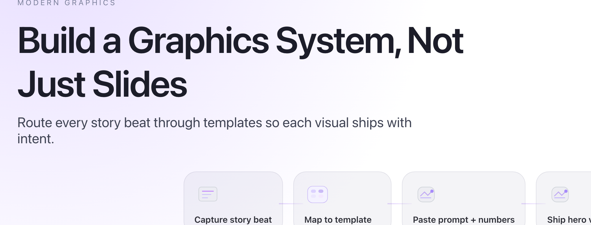 | 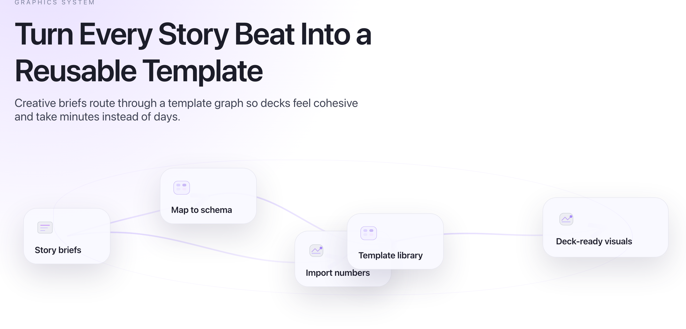 |  |

The thumbnails above are tracked in git for quick reference (`examples/output/showcase/hero-slides/`). To see the latest themed renderings, run `python examples/generate_complete_theme_demo.py` and open `examples/output/theme-demo/index.html`.

[Hero Slides Guide →](docs/HERO_SLIDES.md)

## How Do I Get Started?

Get your first graphic in 5 minutes.

### Installation

```bash
pip install playwright pillow python-dotenv
playwright install chromium
```

That's it! No complex setup needed.

**Note:** Most features work **without an OpenAI API key**. Only prompt-based generation (optional) requires OpenAI. See [Working Without OpenAI](#working-without-openai) below.

### Fastest Path (CLI, Recommended)

Use the unified `create` command as your default workflow:

```bash
modern-graphics create \
  --layout hero \
  --headline "Execution scales. Judgment does not." \
  --density clarity \
  --output ./output/hero.html

modern-graphics create \
  --layout insight-card \
  --text "Constrained execution makes quality repeatable." \
  --density clarity \
  --png \
  --output ./output/insight-card.png
```

Need denser output?

```bash
modern-graphics create \
  --layout timeline \
  --events "Q1|Baseline,Q2|Adoption,Q3|Optimization,Q4|Scale,Q5|Expansion" \
  --density dense \
  --output ./output/timeline-dense.html
```

Legacy commands remain feature-compatible but are compatibility-only and emit migration guidance:

```bash
modern-graphics timeline \
  --title "Legacy Timeline" \
  --events "Q1|Baseline,Q2|Adoption,Q3|Optimization,Q4|Scale" \
  --density clarity \
  --output ./output/legacy-timeline.html
```

### Social Export Examples

Concrete social preset PNGs are tracked here:

- `examples/output/showcase/create-first/social-preset-linkedin.png`
- `examples/output/showcase/create-first/social-preset-x.png`
- `examples/output/showcase/create-first/social-preset-substack-hero.png`

| LinkedIn preset | X preset | Substack hero preset |
|---|---|---|
| 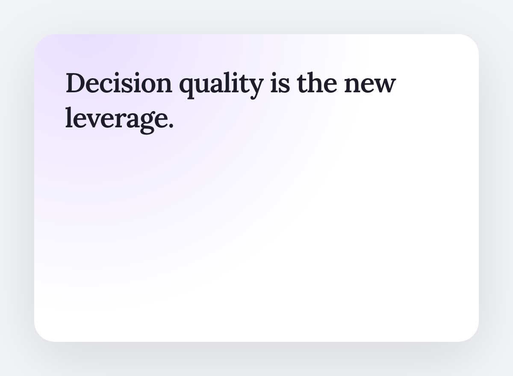 | 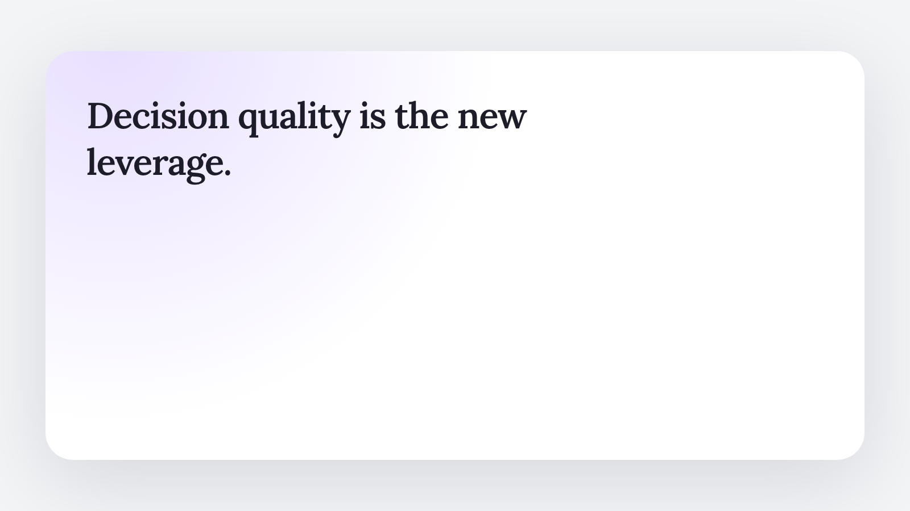 | 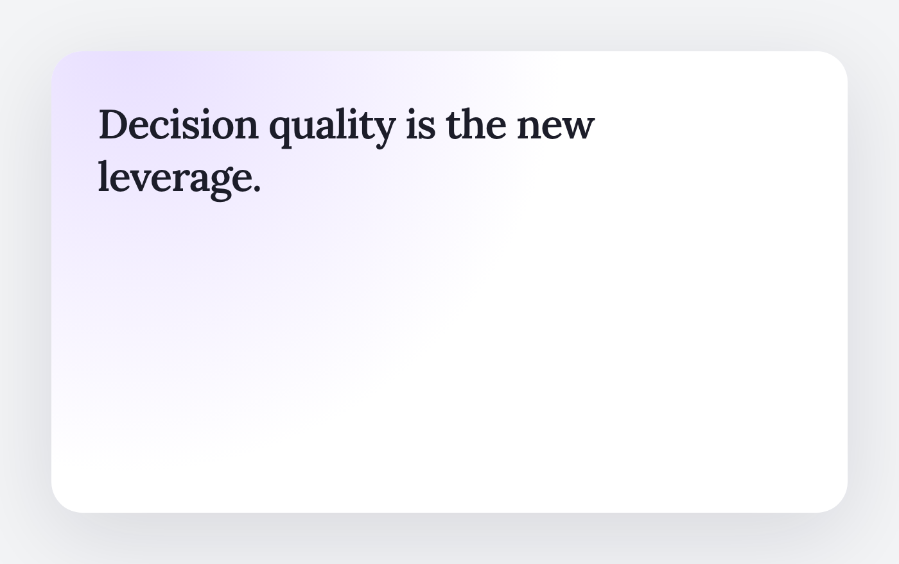 |

Then use these references:
- [Create Command Guide](docs/CREATE_COMMAND.md)
- [Export Guide](docs/EXPORT.md)
- [Migration Guide](docs/MIGRATION.md)

### Programmatic Path (Python API)

Copy and paste this code:

```python
from modern_graphics import ModernGraphicsGenerator, Attribution
from pathlib import Path

# Create a generator
generator = ModernGraphicsGenerator("My First Diagram", Attribution())

# Generate a cycle diagram
html = generator.generate_cycle_diagram([
    {'text': 'Plan', 'color': 'blue'},
    {'text': 'Build', 'color': 'green'},
    {'text': 'Deploy', 'color': 'orange'}
])

# Export as PNG
generator.export_to_png(html, Path('output.png'))
print("✓ Generated output.png")
```

Run it and you'll have your first graphic!

### Your First Theme (Optional but Recommended)

Create a custom theme and apply it to your graphic:

```python
from modern_graphics import generate_scheme_from_prompt

# Create theme from description
scheme = generate_scheme_from_prompt(
    "modern tech startup with bright cyan and coral colors, bold sans-serif font"
)

# Apply to your graphic
html = scheme.apply_to_html(html)
generator.export_to_png(html, Path('output-themed.png'))
```

Now your graphic uses consistent branding that you can apply to all future graphics!

**Next:** Learn about [Core Concepts](docs/CONCEPTS.md) or try [How Do I Prompt Creatively?](#how-do-i-prompt-creatively)

## Examples & Showcase

- **Story slides:** Combine hero canvas, modular cards, and timelines for narratives ([story slide gallery](examples/output/showcase/diagram-types/04-story-slide.png)).  
  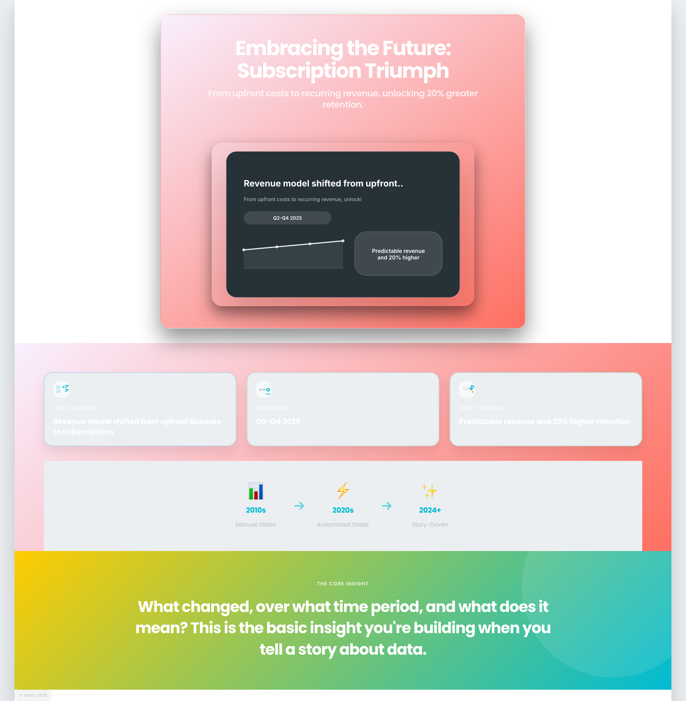
- **Apply one theme everywhere:** Theme demo shows thirteen graphics sharing the same palette/fonts ([see the live set](examples/output/theme-demo/index.html)).  
  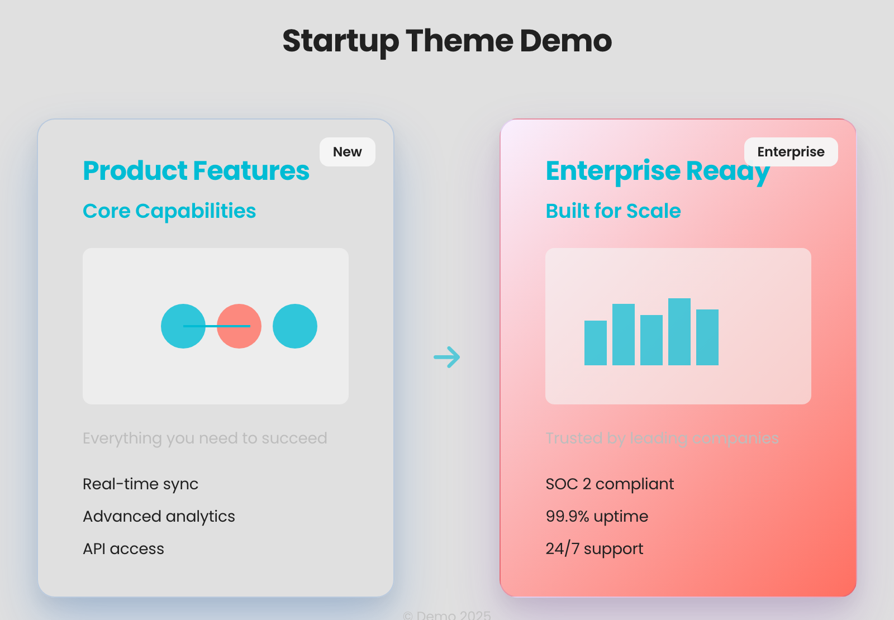 *(PNG checked in; run `python examples/generate_complete_theme_demo.py` to rebuild `index.html` locally)*
- **Illustrate long-form content:** Feed an article outline and let the system storyboard it ([use cases](examples/output/showcase/use-cases/)).  
  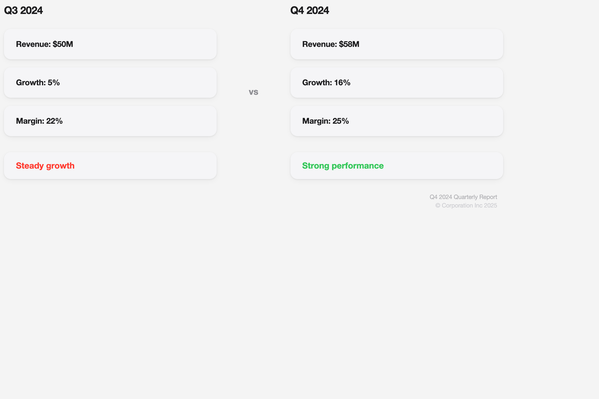
- **Ops guardrail premium cards:** The new `premium-card` CLI renders the stacked hero/detail layout we used for the Ops Leaders “questions for agents” article.  
  ```bash
  modern-graphics premium-card \
    --title "Ops Guardrail Premium Card" \
    --config examples/ops_guardrail_premium_card.json \
    --output examples/output/generated/ops-guardrail-card.png \
    --png
  ```
  Add `--top-only` (hero canvas) or `--bottom-only` (detail card) to mirror the article’s workflow. The command above drops PNGs into `examples/output/generated/` so you can compare your output to the guardrail showcase cards.

Want more? Browse diagram thumbnails in repo (e.g., `examples/output/showcase/hero-slides/01-*.png`), or run `python scripts/run_showcase.py` to regenerate the curated PNGs.

## How Do I Prompt Creatively?

Generate themes and diagrams from natural language prompts using AI. This is an **optional** feature that requires an OpenAI API key.

### Overview

**What it is:** Describe what you want in natural language, AI generates the graphic.

**When to use:**
- You want AI to interpret your description
- You're exploring creative ideas
- You want to generate themes from brand descriptions

**When to use structured data instead:**
- You have exact data structures
- You want precise control
- You don't have an OpenAI API key

### Creative Prompting Techniques

#### Theme Prompts

Generate complete color schemes and fonts from brand descriptions:

```python
from modern_graphics import generate_scheme_from_prompt

# Be specific about colors and style
scheme = generate_scheme_from_prompt(
    "modern tech startup with bright cyan primary color, coral accents, bold Poppins font"
)

# Include industry context
scheme = generate_scheme_from_prompt(
    "professional corporate theme with navy blue accents and serif font for financial services"
)

# Describe mood and aesthetic
scheme = generate_scheme_from_prompt(
    "playful startup theme with vibrant colors and rounded sans-serif font"
)
```

#### Diagram Prompts

Generate diagrams from natural language descriptions:

```python
from modern_graphics import generate_cycle_diagram_from_prompt

# Simple workflow
html = generate_cycle_diagram_from_prompt(
    generator,
    prompt="Show a customer journey: Discover, Try, Buy, Love"
)

# With colors
html = generate_cycle_diagram_from_prompt(
    generator,
    prompt="Show software development: Plan (blue), Build (green), Test (orange), Deploy (purple)"
)

# Comparison diagrams
from modern_graphics import generate_comparison_diagram_from_prompt

html = generate_comparison_diagram_from_prompt(
    generator,
    prompt="Compare manual design (slow, inconsistent) vs template-based (fast, consistent)"
)
```

#### Story Slide Prompts

Generate story-driven slides:

```python
from modern_graphics.prompt_to_diagram import generate_story_slide_from_prompt

html = generate_story_slide_from_prompt(
    generator,
    prompt="""What changed: Revenue model shifted from upfront licenses to subscriptions
Time period: Q2-Q4 2025
What it means: Predictable revenue and 20% higher retention"""
)
```

### Prompt Examples by Type

**Theme Generation:**
- `"modern tech startup with bright cyan and coral colors"`
- `"professional corporate theme with navy blue accents and serif font"`
- `"minimalist design with monochrome palette and clean sans-serif"`

**Cycle Diagrams:**
- `"Show a customer journey: Discover, Try, Buy, Love"`
- `"Marketing funnel: Awareness, Interest, Consideration, Purchase"`
- `"Product development: Research, Design, Build, Launch"`

**Comparison Diagrams:**
- `"Compare manual design vs template-based approach"`
- `"Before: Slow and inconsistent. After: Fast and consistent"`
- `"Traditional vs modern workflow comparison"`

**Timeline Diagrams:**
- `"Product milestones: Q1 Launch, Q2 Growth, Q3 Scale, Q4 Mature"`
- `"Company history: Founded 2020, Series A 2022, IPO 2025"`

### Best Practices

1. **Be Specific** - Include colors, style, mood, and context
   - ✅ `"modern tech startup with bright cyan primary color, coral accents"`
   - ❌ `"tech startup theme"`

2. **Include Context** - Mention industry, audience, or use case
   - ✅ `"professional corporate theme for financial services"`
   - ❌ `"corporate theme"`

3. **Iterate and Refine** - Start broad, then refine based on results
   - First: `"tech startup theme"`
   - Refined: `"modern tech startup with bright cyan and coral, bold sans-serif"`

4. **Combine Approaches** - Use prompts for exploration, structured data for precision
   ```python
   # Generate theme from prompt
   scheme = generate_scheme_from_prompt("...")
   
   # Use structured data for precise diagram
   html = generator.generate_cycle_diagram([
       {'text': 'Step 1', 'color': 'blue'},
       {'text': 'Step 2', 'color': 'green'}
   ])
   
   # Apply theme to structured diagram
   html = scheme.apply_to_html(html)
   ```

### Code Examples

**Generate Theme from Prompt:**
```python
from modern_graphics import generate_scheme_from_prompt

scheme = generate_scheme_from_prompt(
    "modern tech startup with bright cyan and coral colors, bold sans-serif font"
)

# Save for reuse
scheme.save_to_json("my_theme.json")
```

**Generate Diagram from Prompt:**
```python
from modern_graphics import generate_cycle_diagram_from_prompt

html = generate_cycle_diagram_from_prompt(
    generator,
    prompt="Show a customer journey: Discover, Try, Buy, Love"
)

generator.export_to_png(html, Path('customer-journey.png'))
```

**Combine Prompt + Structured Data:**
```python
# Generate theme from prompt
scheme = generate_scheme_from_prompt("corporate professional theme")

# Create diagram with structured data
html = generator.generate_cycle_diagram([
    {'text': 'Plan', 'color': 'blue'},
    {'text': 'Build', 'color': 'green'},
    {'text': 'Deploy', 'color': 'orange'}
])

# Apply theme
html = scheme.apply_to_html(html)
```

### Learn More

- **[Prompts Guide](docs/PROMPTS.md)** - Complete prompt-based generation guide
- **[Use Cases](docs/USE_CASES.md)** - Real-world prompt examples and patterns
- **[Prompt Examples](docs/PROMPT_EXAMPLES.md)** - More creative prompt examples

## Customization Guide

Create custom themes and apply consistent branding across all your graphics.

### Create Custom Themes

#### From Prompt (AI-powered) - Recommended

```python
from modern_graphics import generate_scheme_from_prompt

# Describe your brand - get complete color scheme + font
scheme = generate_scheme_from_prompt(
    "modern tech startup with bright cyan and coral colors, bold sans-serif font"
)

# Apply to any graphic
html = generator.generate_modern_hero(...)
html = scheme.apply_to_html(html)  # Colors + fonts applied automatically
```

#### Manual Creation

```python
from modern_graphics import create_custom_scheme

scheme = create_custom_scheme(
    name="My Brand",
    primary="#8B5CF6",  # Your brand color
    google_font_name="Roboto",  # Google Font
    font_style="sans-serif"
)

# Save and share
scheme.save_to_json("my_theme.json")
```

#### Advanced Custom Theme (Full Control)

For complete control over fonts, colors, and effects, define a `ColorScheme` directly. This is especially useful for dark themes or brand-specific styling.

| Hero Story | Key Insight | Insight Card |
|------------|-------------|--------------|
| 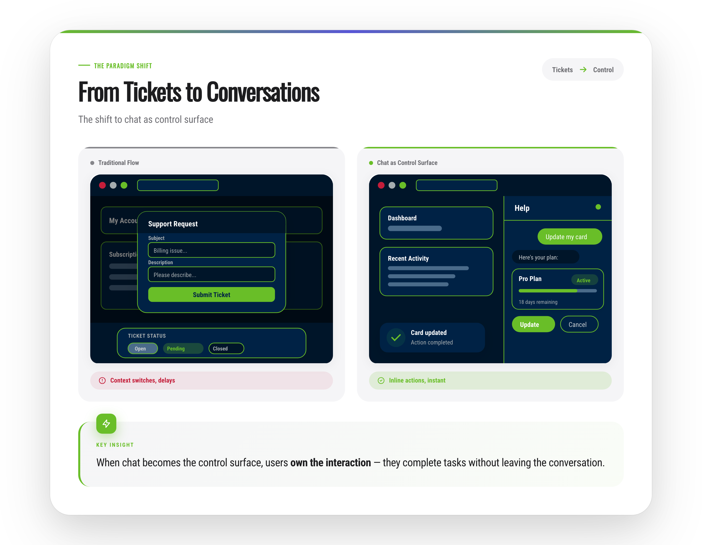 | 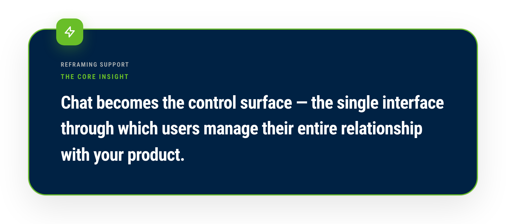 | 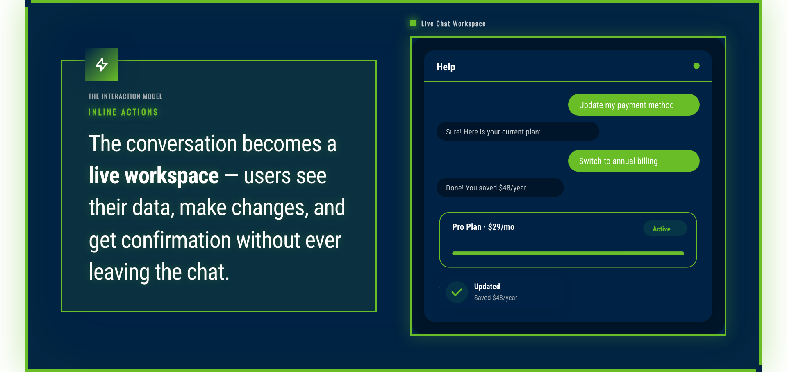 |

```python
from modern_graphics.color_scheme import ColorScheme
from modern_graphics.diagrams.wireframe_svg import WireframeSVGConfig

# Define a complete custom theme (e.g., Seattle Seahawks)
MY_THEME = ColorScheme(
    name="My Brand",
    description="Custom brand theme",
    # Fonts - use display font for headlines, body font for text
    google_font_name="Roboto Condensed",
    google_font_weights="400;700",
    font_style="sans-serif",
    google_fonts_extra=["Oswald"],  # Additional fonts to load
    font_family_display="'Oswald', 'Roboto Condensed', sans-serif",
    font_family_body="'Roboto Condensed', sans-serif",
    # Colors
    primary="#69BE28",      # Main accent
    secondary="#A5ACAF",    # Secondary accent
    accent="#002244",       # Tertiary accent
    success="#69BE28",
    error="#c41e3a",
    # Text colors (use light text for dark backgrounds)
    text_primary="#FFFFFF",
    text_secondary="#C8CDD0",
    text_tertiary="#A5ACAF",
    # Backgrounds (dark theme example)
    bg_primary="#002244",   # Card backgrounds
    bg_secondary="#001529", # Page background
    bg_tertiary="#4A6B8A",  # Tertiary elements
    # Borders
    border_light="#003366",
    border_medium="#69BE28",
    # Effects (optional)
    effects={"glow": True},
    glow_color="#69BE28",
)

# Create wireframe config from theme (with custom button colors for contrast)
def get_wireframe_config(width=400, height=300):
    return WireframeSVGConfig(
        width=width,
        height=height,
        accent_color=MY_THEME.primary,
        success_color=MY_THEME.success,
        text_primary=MY_THEME.text_primary,
        surface_1=MY_THEME.bg_primary,
        surface_2=MY_THEME.bg_secondary,
        border_color=MY_THEME.border_medium,
        font_family=MY_THEME.font_family_body,
        # For dark themes, set explicit button colors
        button_bg=MY_THEME.primary,
        button_text="#002244",  # Contrasting text
    )

# Use with insight graphics
html = generate_key_insight(
    generator,
    text="Your insight here",
    variant="bold",
    color_scheme=MY_THEME,
)

# Use with wireframes
config = get_wireframe_config()
svg = generate_after_wireframe_svg(config)
```

#### Use Predefined Schemes

8 built-in themes are available:

| Theme | Description |
|-------|-------------|
| `apple` | Clean, minimal Apple-inspired design |
| `corporate` | Professional blue/gray for business |
| `dark` | Dark mode with bright accents |
| `warm` | Friendly orange/amber tones |
| `green` | Nature-inspired green palette |
| `arcade` | Retro 8-bit with neon colors and pixel fonts |
| `nike` | Bold athletic style with volt green |
| `operator-clarity-v2` | Direct editorial system for decision-quality narratives |

```python
from modern_graphics.color_scheme import get_scheme, APPLE_SCHEME, ARCADE_SCHEME

# Get by name
scheme = get_scheme("apple")

# Or import directly
html = APPLE_SCHEME.apply_to_html(generated_html)
```

### Apply Themes

```python
# Generate a graphic
html = generator.generate_modern_hero(...)

# Apply theme
html = scheme.apply_to_html(html)

# Export
generator.export_to_png(html, Path('output.png'))
```

**See complete example:** [Theme Demo Script](examples/generate_complete_theme_demo.py) | [Theme Demo Gallery (run locally)](examples/output/theme-demo/index.html)

### Advanced Customization

- **[Color Scheme Generator Guide](docs/ADVANCED.md#color-scheme-generator)** - Complete theme creation guide
- **[Custom Templates](docs/ADVANCED.md#custom-templates)** - Create custom templates
- **[SVG.js Integration](docs/ADVANCED.md#svgjs-integration)** - Custom SVG graphics
- **[Advanced Topics](docs/ADVANCED.md)** - All advanced features

## Insight Graphics Guide

Create compelling insight graphics for articles and presentations. The system supports a full workflow: **wireframe → SVG → presentation**.

**Preview thumbnails:** PNG examples are in `examples/output/showcase/insight-graphics/` (tracked in git).

### Graphic Types

#### 1. Key Insight (Standalone Pull Quote)

A standalone insight/pull quote with multiple style variants.

| Default | Bold | Quote |
|---------|------|-------|
| 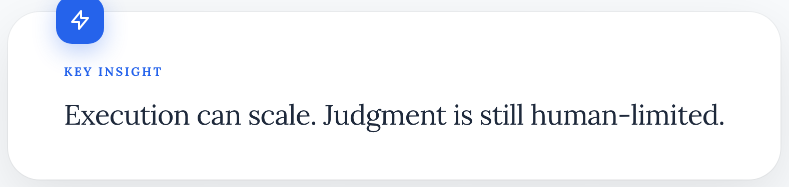 |  |  |

```python
from modern_graphics.diagrams.insight import generate_key_insight

html = generate_key_insight(
    generator,
    text="The chatbot isn't replacing <span class=\"highlight\">resolution</span>. It's replacing <span class=\"highlight\">waiting</span>.",
    label="Key Insight",
    eyebrow="Chat as Control Surface",
    context="Action happens inline, in context, without handoffs.",
    variant="bold",  # "default", "minimal", "bold", "quote"
    icon="lightning",  # "lightning", "lightbulb", "quote", "star", "none"
)
```

**Variants:**
- `default` - Standard card with icon
- `minimal` - Left border accent, no icon
- `bold` - Gradient background with accent border
- `quote` - Pull quote style with large quote icon

#### 2. Insight Card (Insight + SVG)

Combines a key insight with an illustrative SVG wireframe.


```python
from modern_graphics.diagrams.insight import generate_insight_card
from modern_graphics.diagrams.wireframe_svg import generate_after_wireframe_svg

# Generate wireframe SVG
svg = generate_after_wireframe_svg()

# Create card
html = generate_insight_card(
    generator,
    text="The key insight text...",
    svg_content=svg,
    label="Key Insight",
    svg_label="Inline control surface",
    layout="side-by-side",  # or "stacked"
    svg_position="right",   # or "left"
    variant="bold",
)
```

#### 3. Insight Story (Full Graphic)

Complete insight graphic with before/after comparison, shift indicators, and stats.


```python
from modern_graphics.diagrams.insight import generate_insight_story
from modern_graphics.diagrams.wireframe_svg import (
    generate_before_wireframe_svg,
    generate_after_wireframe_svg,
)

# Generate wireframes
before_svg = generate_before_wireframe_svg()
after_svg = generate_after_wireframe_svg()

# Create full story
html = generate_insight_story(
    generator,
    headline="Chat is a Dynamic Control Surface",
    subtitle="When conversations stay stateful and take action without handoffs...",
    eyebrow="The Interface Shift",
    before_svg=before_svg,
    before_label="Ticketed Support",
    before_status={"type": "negative", "text": "Context interrupted"},
    after_svg=after_svg,
    after_label="Inline Chat",
    after_status={"type": "positive", "text": "Context preserved"},
    shift_from="Tickets",
    shift_to="Control",
    shift_badge="User-owned inbox",
    insight_text="The chatbot isn't replacing resolution. It's replacing <span class=\"highlight\">waiting</span>.",
    stats=[
        {"label": "Old Model", "value": "Declare → Queue → Wait"},
        {"label": "New Model", "value": "Intent → Inline action"},
    ],
)
```

### SVG Wireframe Generators

Generate pure SVG wireframes for embedding in insight graphics or other compositions.

```python
from modern_graphics.diagrams.wireframe_svg import (
    WireframeSVGConfig,
    generate_chat_panel_svg,
    generate_modal_form_svg,
    generate_before_wireframe_svg,
    generate_after_wireframe_svg,
    generate_ticket_flow_svg,
)

# Configure appearance
config = WireframeSVGConfig(
    width=400,
    height=300,
    accent_color="#0071e3",
    success_color="#34c759",
)

# Generate specific wireframes
chat_svg = generate_chat_panel_svg(
    config=config,
    messages=[
        {"role": "user", "text": "Update my card"},
        {"role": "assistant", "text": "Here's your plan:"},
    ],
    inline_card={"title": "Pro Plan", "status": "Active", "progress": 75},
    action_buttons=["Update", "Cancel"],
    success_toast={"title": "Card updated", "subtitle": "Action completed"},
)

modal_svg = generate_modal_form_svg(
    config=config,
    title="Support Request",
    fields=["Email", "Description"],
    submit_label="Submit",
)

# Or use the pre-composed before/after wireframes
before_svg = generate_before_wireframe_svg(config)  # Modal + ticket status
after_svg = generate_after_wireframe_svg(config)    # App with chat panel
```

### CLI Commands

Use `create` as the default CLI path for insight graphics:

```bash
# Key Insight with theme
modern-graphics create \
  --layout key-insight \
  --text "The insight text with <span class=\"highlight\">highlights</span>" \
  --variant bold \
  --theme apple \
  --png \
  --output insight.png

# Insight Card with theme and auto-generated wireframe
modern-graphics create \
  --layout insight-card \
  --text "The insight text..." \
  --svg-label "Inline control surface" \
  --theme apple \
  --png \
  --output card.png

# Insight Card with custom SVG file
modern-graphics create \
  --layout insight-card \
  --text "The insight text..." \
  --svg-file my-wireframe.svg \
  --theme corporate \
  --png \
  --output card.png

# Insight Story with theme and auto-generated wireframes
modern-graphics create \
  --layout insight-story \
  --headline "Chat is a Dynamic Control Surface" \
  --subtitle "When conversations stay stateful..." \
  --eyebrow "The Interface Shift" \
  --insight-text "The key insight..." \
  --theme apple \
  --png \
  --output story.png

# Legacy CLI syntax is kept in docs/MIGRATION.md.
```

**Available themes:** `apple`, `corporate`, `dark`, `warm`, `green`, `arcade`, `nike`, `operator-clarity-v2`

### Export Settings

For inline-ready graphics, use tight padding:

```python
# Tight cropping for inline use
generator.export_to_png(html, "output.png", padding=10)

# No padding at all
generator.export_to_png(html, "output.png", padding=0)

# Standard padding for standalone graphics
generator.export_to_png(html, "output.png", padding=40)
```

### Theme Integration

All insight graphics respect the ColorScheme system. Use themes via CLI or Python:

**CLI (recommended for quick generation):**
```bash
# Use any of the 8 built-in themes
modern-graphics create --layout key-insight --text "Your insight" --theme apple --png --output insight.png
modern-graphics create --layout insight-card --text "Your insight" --theme arcade --png --output card.png
modern-graphics create --layout insight-story --headline "Title" --insight-text "Why this matters" --theme nike --png --output story.png
modern-graphics create --layout hero --headline "Judgment is the bottleneck" --theme corporate --png --output hero.png
```

**Python (for custom themes or programmatic use):**
```python
from modern_graphics import create_custom_scheme
from modern_graphics.color_scheme import get_scheme, APPLE_SCHEME
from modern_graphics.diagrams.wireframe_svg import WireframeSVGConfig

# Use a built-in scheme
scheme = get_scheme("apple")  # or APPLE_SCHEME

# Or create custom scheme
scheme = create_custom_scheme(
    name="My Brand",
    primary="#6366f1",
    google_font_name="Inter",
)

# Apply to wireframe config
config = WireframeSVGConfig.from_color_scheme(scheme)

# Generate themed wireframe
svg = generate_chat_panel_svg(config=config, ...)

# Apply theme to insight card
html = generate_insight_card(generator, ..., color_scheme=scheme)
```

## Core Concepts

Understanding these concepts will help you use the library effectively.

### 1. The Generator

The `ModernGraphicsGenerator` is the main class that creates graphics. You create one, then use it to generate different diagram types.

```python
from modern_graphics import ModernGraphicsGenerator, Attribution

generator = ModernGraphicsGenerator(
    title="My Diagram",
    attribution=Attribution()
)

# Generate different diagram types
html = generator.generate_cycle_diagram([...])
html = generator.generate_comparison_diagram(...)
html = generator.generate_timeline_diagram(...)
```

**Learn more:** [Core Concepts Guide](docs/CONCEPTS.md)

### 2. Diagram Types

The library includes 10+ diagram types, each optimized for different use cases.

**Choose the right type:**
- **Process/Flow** → Cycle Diagram
- **Comparison** → Comparison Diagram
- **Timeline** → Timeline Diagram
- **Story/Narrative** → Story Slide
- **List/Grid** → Grid Diagram
- **Hierarchy** → Pyramid Diagram
- **Growth Loop** → Flywheel Diagram

**Learn more:** [Diagram Types Guide](docs/DIAGRAM_TYPES.md)

### 3. Custom Themes

**One theme, all graphics.** Define colors and fonts once, apply consistently across hero slides, slide cards, and diagrams.

**Why Use Themes?**
- **Consistency**: All graphics match your brand automatically
- **Speed**: Apply styles instantly with one line of code
- **Team Alignment**: Share theme JSON files for consistent branding
- **Flexibility**: Switch themes or create variations easily
- **Template = Theme**: We no longer ship a separate “template gallery.” The active color scheme drives typography, card chrome, and hero styling across every diagram (see [theme demo](examples/output/theme-demo/index.html)).

**See it in action:** [Complete Theme Demo (generate locally)](examples/output/theme-demo/index.html) - 7 graphics, one theme

**Learn more:** [Color Scheme Generator Guide](docs/ADVANCED.md#color-scheme-generator)

### 4. Attribution

Attribution adds copyright and context information to your graphics. It appears at the bottom of generated images.

```python
from modern_graphics import Attribution

attribution = Attribution(
    copyright="© My Company 2025",
    context="Q4 Report",
    position="bottom-right"
)
```

**Learn more:** [Core Concepts Guide](docs/CONCEPTS.md#attribution)

## Working Without OpenAI

**Good news:** Most features work **without an OpenAI API key**! You only need OpenAI for prompt-based generation (which is optional).

### What Works Without OpenAI ✅

All structured data generation works without OpenAI:

- ✅ **Cycle diagrams** - `generate_cycle_diagram(steps)`
- ✅ **Comparison diagrams** - `generate_comparison_diagram(left, right)`
- ✅ **Timeline diagrams** - `generate_timeline_diagram(events)`
- ✅ **Story slides** - `generate_story_slide(...)`
- ✅ **Hero slides** - `generate_modern_hero(...)`
- ✅ **Insight graphics** - `generate_key_insight()`, `generate_insight_card()`, `generate_insight_story()`
- ✅ **SVG wireframes** - `generate_chat_panel_svg()`, `generate_before_wireframe_svg()`, etc.
- ✅ **CLI commands** - All CLI commands work without OpenAI
- ✅ **PNG export** - Export works without OpenAI
- ✅ **Templates** - Using existing templates works without OpenAI

### What Requires OpenAI ⚠️

Only these **optional** prompt-based features require OpenAI:

- ⚠️ **Prompt-based generation** - `generate_*_from_prompt()` functions
- ⚠️ **AI theme creation** - `generate_scheme_from_prompt()`

**Bottom line:** Use structured data (dictionaries, lists) and you don't need OpenAI. Use prompts (natural language) and you'll need an OpenAI API key.

**Example without OpenAI:**
```python
from modern_graphics import ModernGraphicsGenerator, Attribution
from pathlib import Path

# Works without OpenAI API key!
generator = ModernGraphicsGenerator("My Diagram", Attribution())

# Generate slide card (structured data - no OpenAI)
cards = [{
    "title": "Revenue Transformation",
    "tagline": "Q2-Q4 2025",
    "subtext": "Revenue model shifted from licenses to subscriptions",
    "color": "blue",
    "badge": "+24% QoQ"
}]

html = generator.generate_slide_card_diagram(cards)
generator.export_to_png(html, Path('output.png'))
```

## Documentation

### Overhaul Checkpoint (Phase 1 + 2 + Phase 3 Step 4)
- **[Overhaul Spec](docs/OVERHAUL_SPEC.md)** - Phase plan, quality gates, and locked decisions
- **[Overhaul Workplan](docs/OVERHAUL_WORKPLAN.md)** - Active workstreams and milestone tracking

Run current checkpoint validation:

```bash
python scripts/validate_overhaul_phase1.py
python scripts/run_phase1_quality_harness.py
python scripts/run_insight_fixture_harness.py
```

Clarity-first `create` workflow (feature-flagged):

```bash
modern-graphics create \
  --layout hero \
  --headline "Execution scales. Judgment stays scarce." \
  --output ./output/clarity-hero.html
```

`create` uses progressive disclosure:
- `core`: `--layout`, `--output`, `--title`, `--theme`
- `layout-specific`: only the content fields needed for your selected layout
- `expert`: density/export controls (`--density`, `--png`, `--crop-mode`, `--padding-mode`)

Current `create --layout` options:
- `hero`, `insight`, `key-insight`, `insight-card`, `insight-story`
- `comparison`, `story`, `timeline`, `funnel`, `grid`

Create defaults (clarity mode):
- density: `clarity`
- crop mode: `safe`
- padding mode: `minimal`
- theme: `corporate`

Use the canonical guide for decision table + recipes:
- **[Create Command Guide](docs/CREATE_COMMAND.md)**
- **[Migration Guide](docs/MIGRATION.md)** (legacy -> `create`)
- **[Deprecation Policy](docs/DEPRECATION_POLICY.md)** (warn/freeze/error/removal stages)

CLI posture:
- `create` is the default surface for all new workflows.
- legacy commands are compatibility-only and emit migration guidance.

Smoke fixtures and checks live in:
- `tests/smoke/fixtures_phase1.json`
- `tests/smoke/test_overhaul_phase1_smoke.py`
- `tests/smoke/test_layout_strategy_smoke.py`

Generated Phase 1 reports:
- `reports/phase1-quality.json`
- `reports/phase1-quality.md`
- `reports/phase1-token-debt.json`
- `reports/phase1-token-debt.md`
- `reports/phase2-strict-lint.json`
- `reports/phase2-strict-lint.md`
- `reports/phase2-insight-fixtures.json`
- `reports/phase2-insight-fixtures.md`

Phase 2 scaffolding (in progress):
- Layout strategy registry: `modern_graphics/layouts.py`
  - Programmatic entrypoint: `ModernGraphicsGenerator.generate_layout(layout_type, **kwargs)`
  - Built-ins: `hero`, `hero-triptych`, `insight-story`, `key-insight`, `insight-card`
- Typed layout payloads: `modern_graphics/layout_models.py`
  - `HeroPayload`, `ComparisonPayload`, `TimelinePayload`, `FunnelPayload`, `GridPayload`
  - `KeyInsightPayload`, `InsightCardPayload`, `InsightStoryPayload`
  - CLI `create` validates these payloads before strategy render.
- Strict template lint gate: `modern_graphics/template_lint.py`
  - Report outputs:
    - `reports/phase2-strict-lint.json`
    - `reports/phase2-strict-lint.md`
- Insight fixture regression harness:
  - script: `scripts/run_insight_fixture_harness.py`
  - outputs:
    - `reports/phase2-insight-fixtures.json`
    - `reports/phase2-insight-fixtures.md`
    - `reports/insight-fixtures/01-key_insight.html`
    - `reports/insight-fixtures/02-insight_card.html`
    - `reports/insight-fixtures/03-insight_story.html`

### Getting Started
- **[Quick Start Guide](docs/QUICKSTART.md)** - Get your first graphic in 5 minutes
- **[Core Concepts](docs/CONCEPTS.md)** - Learn the four essential concepts
- **[Diagram Types Guide](docs/DIAGRAM_TYPES.md)** - Choose the right diagram type

### Guides
- **[Use Cases](docs/USE_CASES.md)** - Real-world examples and patterns
- **[Hero Slides Guide](docs/HERO_SLIDES.md)** - Modern hero slide layouts
- **[Create Command Guide](docs/CREATE_COMMAND.md)** - Unified `create` mental model and recipes
- **[Strategy Extension](docs/STRATEGY_EXTENSION.md)** - Add a new layout strategy with payload + gates
- **[Prompts Guide](docs/PROMPTS.md)** - Prompt-based generation
- **[Export Guide](docs/EXPORT.md)** - PNG export options and settings

### Reference
- **[API Reference](docs/API.md)** - Complete API documentation
- **[Advanced Topics](docs/ADVANCED.md)** - SVG.js, custom diagrams, templates
- **[Troubleshooting](docs/TROUBLESHOOTING.md)** - Common issues and solutions

### Examples
- **[Examples Directory](examples/)** - All example scripts organized by category
- **[Showcase Gallery](examples/output/showcase/)** - High-quality examples for documentation

## Installation & Requirements

### Basic Requirements

```bash
pip install playwright pillow python-dotenv
playwright install chromium
```

- Python 3.8+
- Playwright (for PNG export)
- Pillow (for image processing)

### Optional: OpenAI Support

For prompt-based generation:

```bash
pip install openai
```

Set `OPENAI_API_KEY` in your `.env` file:

```bash
OPENAI_API_KEY=your_openai_key_here
```

## Next Steps

**New to the library?**
1. Start with [How Do I Get Started?](#how-do-i-get-started) - Installation + first graphic + first theme
2. Try the [Examples Directory](examples/) - See working code
3. Browse the [Showcase Gallery](examples/output/showcase/) - See what's possible

**Want to customize?**
1. **Create [Custom Themes](docs/ADVANCED.md#color-scheme-generator)** - Define colors and fonts once, apply everywhere
   - See [Complete Theme Demo](examples/output/theme-demo/index.html) (generate locally) for inspiration
   - Try [Theme Demo Script](examples/generate_complete_theme_demo.py)
2. Learn about [Templates](docs/ADVANCED.md#custom-templates)
3. Check out [Advanced Topics](docs/ADVANCED.md)

**Want to use prompts?**
1. Read [How Do I Prompt Creatively?](#how-do-i-prompt-creatively) - Techniques and examples
2. See [Prompts Guide](docs/PROMPTS.md) - Complete guide
3. Check [Use Cases](docs/USE_CASES.md) - Real-world patterns

**Need help?**
1. Check [Troubleshooting](docs/TROUBLESHOOTING.md)
2. Review [Examples Directory](examples/)
3. See [Use Cases](docs/USE_CASES.md) for patterns

## License

MIT

## Contributing

Contributions welcome! The system is designed to be extensible:
- Add new diagram types by implementing `DiagramGenerator`
- Add new templates using `TemplateBuilder`
- Submit PRs for improvements

See [Contributing Guide](docs/CONTRIBUTING.md) for more details.
