# Modern Graphics Generator

Build hero slides, insight cards, and diagrams from one CLI with clarity-first defaults.

## What You Can Build

| Insight Card | Key Insight Quote | Insight Story |
|---|---|---|
| [](examples/output/showcase/create-first/insight-card.png) | [](examples/output/showcase/create-first/key-insight-quote.png) | [](examples/output/showcase/create-first/insight-story.png) |

| Hero | Triptych Hero | Open Canvas Hero |
|---|---|---|
| [](examples/output/showcase/create-first/hero.png) | [](examples/output/showcase/hero-slides/05-triptych.png) | [](examples/output/showcase/hero-slides/02-open-canvas-flowchart.png) |

| Cycle Diagram | Timeline Diagram | Slide Cards |
|---|---|---|
| [](examples/output/showcase/diagram-types/01-cycle.png) | [](examples/output/showcase/diagram-types/03-timeline.png) | [](examples/output/showcase/diagram-types/07-slide-cards.png) |

| Equation (Dark) | Equation (Apple) |
|---|---|
| [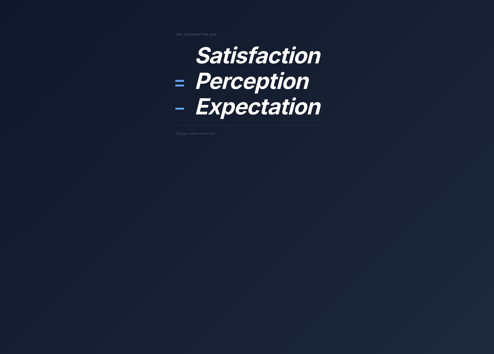](examples/output/showcase/create-first/equation-dark.png) | [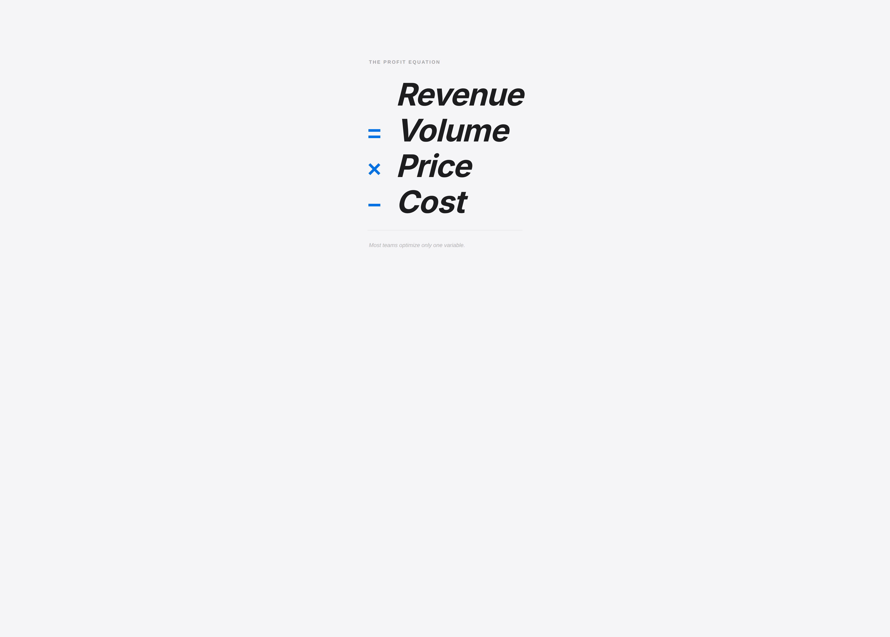](examples/output/showcase/create-first/equation-apple.png) |

| Line Chart | Bar Chart | Grouped Bar |
|---|---|---|
| [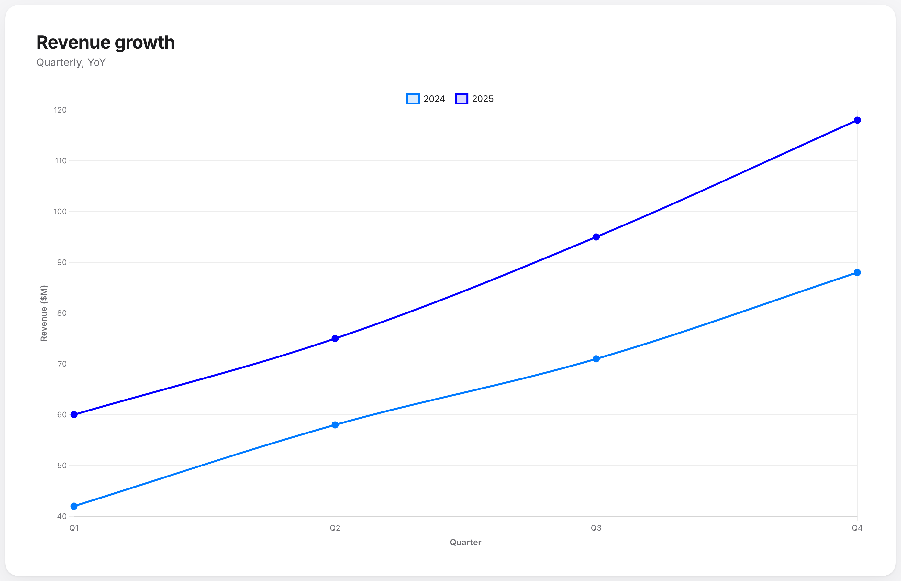](examples/output/showcase/charts/chart_line.png) | [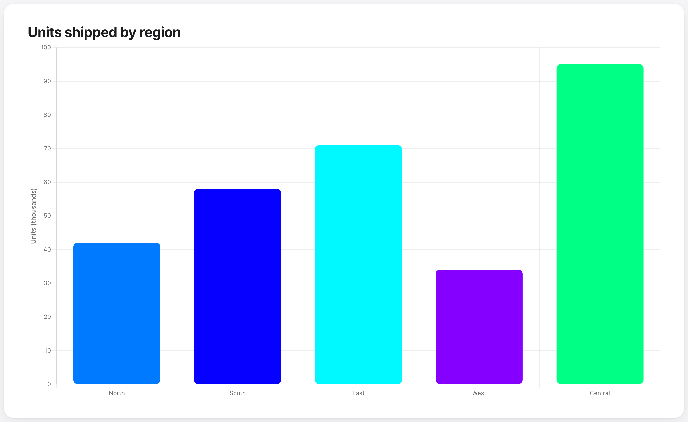](examples/output/showcase/charts/chart_bar.png) | [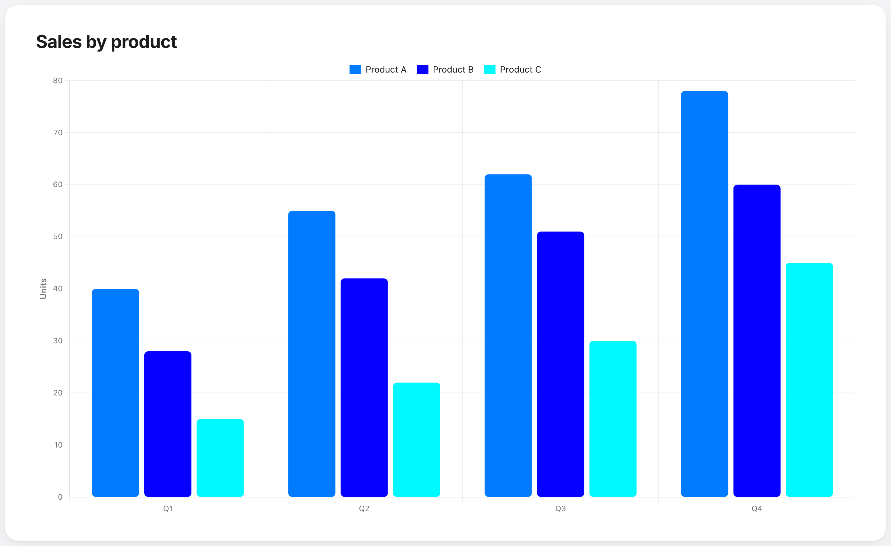](examples/output/showcase/charts/chart_grouped_bar.png) |

| Horizontal Bar | Stacked Bar | Grouped Stacked Bar |
|---|---|---|
| [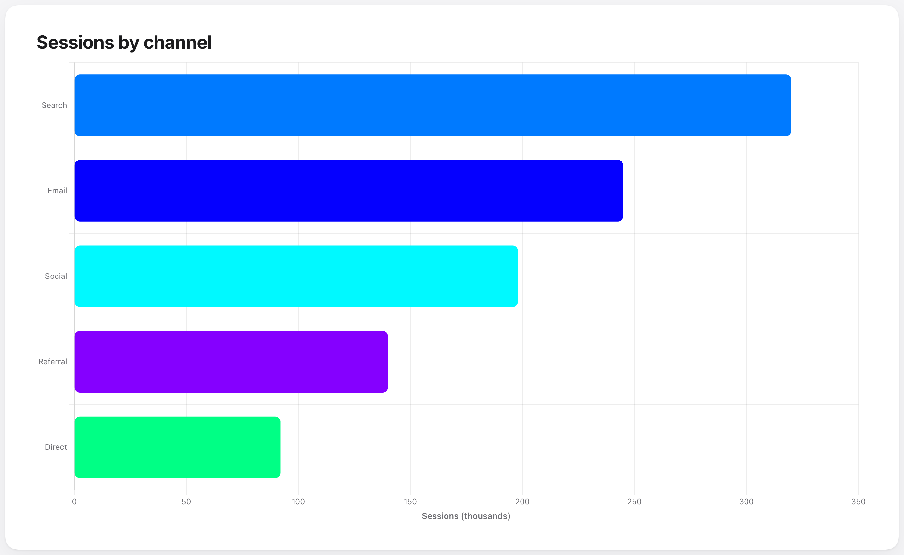](examples/output/showcase/charts/chart_horizontal_bar.png) | [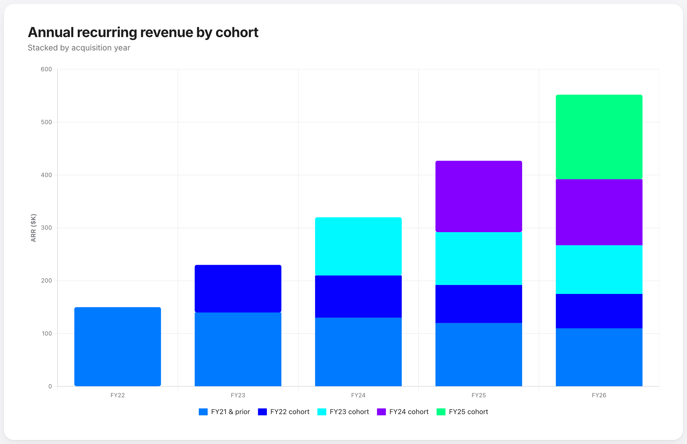](examples/output/showcase/charts/chart_stacked_bar.png) | [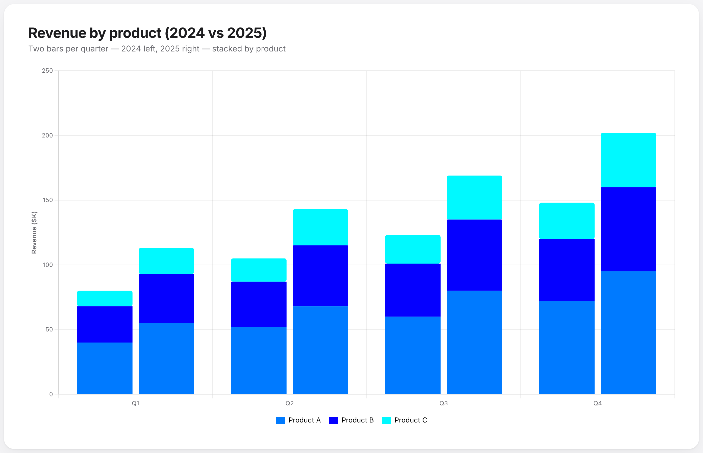](examples/output/showcase/charts/chart_grouped_stacked_bar.png) |

| Stacked Area | Pie | Donut |
|---|---|---|
| [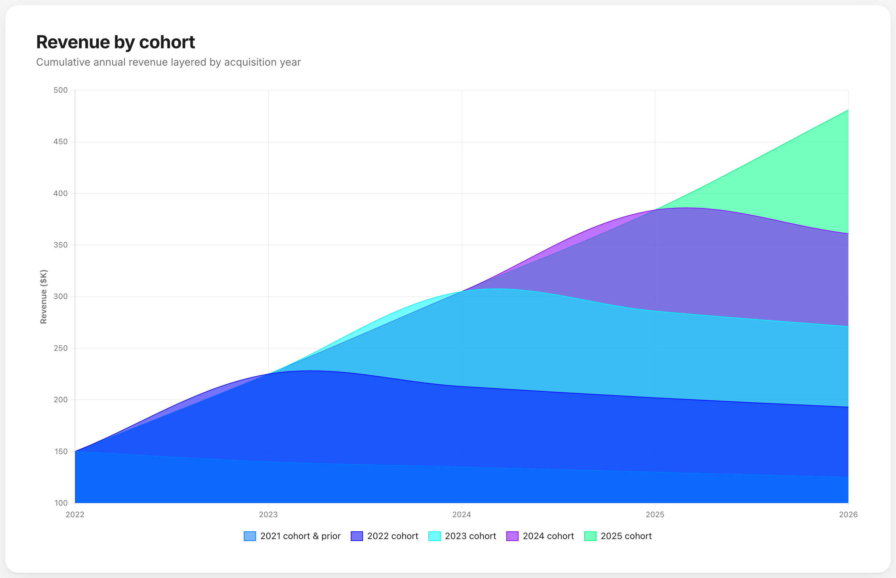](examples/output/showcase/charts/chart_stacked_area.png) | [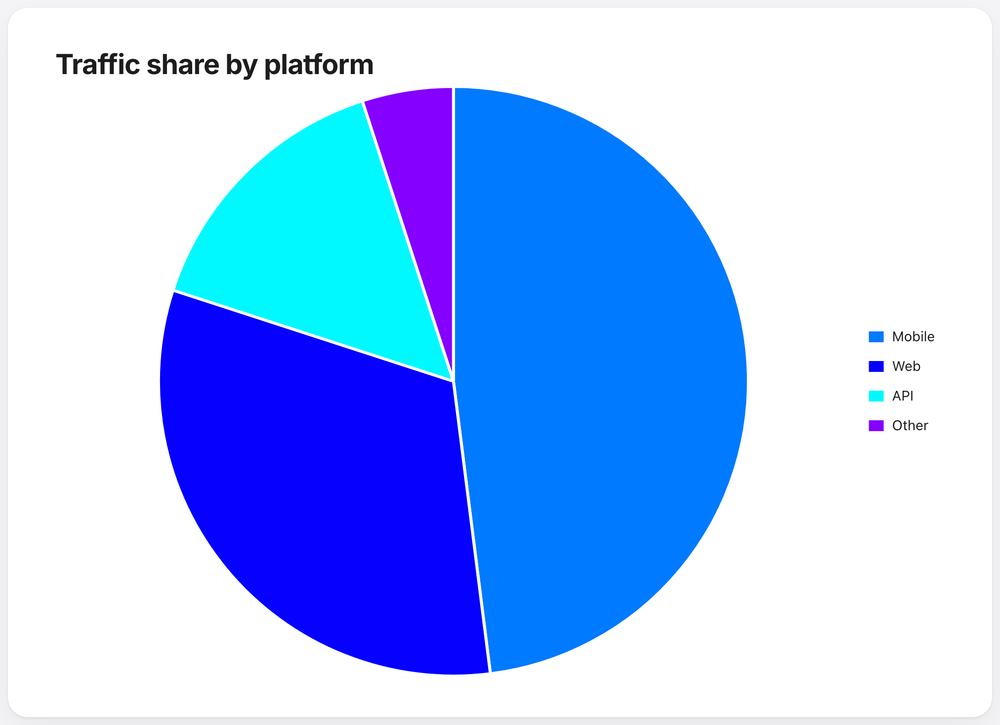](examples/output/showcase/charts/chart_pie.png) | [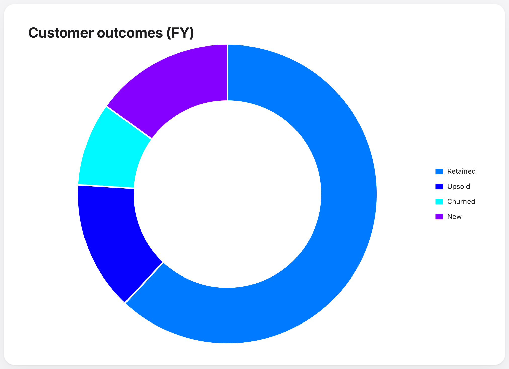](examples/output/showcase/charts/chart_donut.png) |

| Sankey | Cohort Retention Heatmap |
|---|---|
| [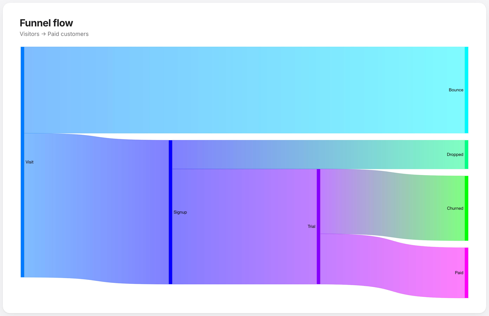](examples/output/showcase/charts/chart_sankey.png) | [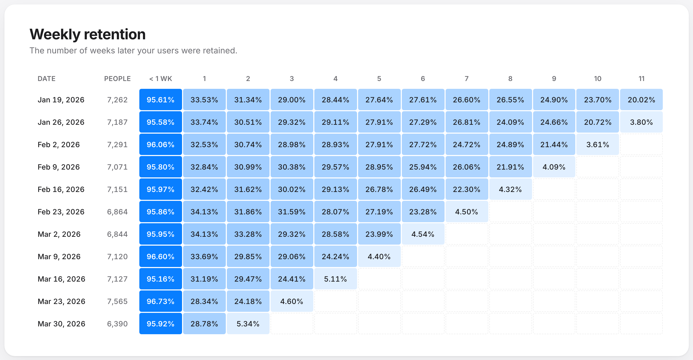](examples/output/showcase/charts/chart_cohort.png) |

Canonical showcase assets live in `examples/output/showcase/`.

## Quick Switch (Jobs To Be Done)

- [Use the package](#use-the-package-2-minutes)
- [Make graphics](#make-graphics-3-minutes)
- [Build a custom theme (font/colors)](#build-a-custom-theme-fontcolors-8-minutes)
- [Build a super custom hero](#build-a-super-custom-hero-10-minutes)
- [Call the CLI directly](#call-the-cli-directly-5-minutes)

## First Commands (Most Common Jobs)

### Make graphics (about 3 minutes)

```bash
modern-graphics create \
  --layout hero \
  --headline "Execution scales. Judgment does not." \
  --png \
  --output ./output/hero.png
```

Expected output: `./output/hero.png`.

### Build a custom theme (about 8 minutes)

```bash
python examples/custom_template.py
```

Expected output: `dark_cycle_example.html`.

## Start Here

### Option A: Docker (no local install)

```bash
./generate hero --headline "Execution scales. Judgment does not."
# ✓ ./output/hero.png
```

The wrapper auto-builds the Docker image on first run, defaults to PNG, and writes to `./output/`.

```bash
# HTML instead of PNG
./generate hero --headline "My title" --html

# Custom filename
./generate hero --headline "My title" -o my-hero

# Custom output directory
OUTPUT_DIR=~/Desktop ./generate hero --headline "My title"
```

**Make targets** (for more control):

| Target | What it does |
|--------|-------------|
| `make build` | Build the Docker image |
| `make run ARGS='...'` | Run any `modern-graphics` CLI command |
| `make test` | Run the smoke-test suite inside the container |
| `make shell` | Drop into an interactive bash shell in the container |
| `make gallery` | Generate a static gallery site in `site/` |
| `make site` | Serve interactive gallery at `http://localhost:8484` |
| `make help` | Print available targets |

**Where do files go?** Generated files land on your local disk at `./output/`, not inside Docker. The container mounts your host directory, writes the file, and exits — the 2.75GB image stays the same size no matter how many graphics you generate. To reclaim space from stale build layers: `docker image prune`.

### Browse the Gallery

See all available layouts and themes visually:

```bash
make gallery        # generate static site
open site/index.html  # browse layouts and themes offline
```

Or serve the interactive version with live graphic generation:

```bash
make site           # starts at http://localhost:8484
```

The interactive gallery lets you pick a layout, fill in content, choose a theme, and generate graphics in-browser. Each result includes copyable CLI and MCP commands.

### Option B: MCP Server (AI-assisted)

Let Claude or other AI clients generate graphics for you via tool calls:

```bash
pip install modern-graphics-generator[mcp]
```

Configure in Claude Code (`.mcp.json`), then ask: "make me a comparison graphic of manual vs automated."

See [MCP Server Guide](docs/MCP_SERVER.md) for full setup.

### Option C: pip install

Install dependencies once:

```bash
pip install playwright pillow python-dotenv
playwright install chromium
```

Generate a first PNG:

```bash
modern-graphics create \
  --layout hero \
  --headline "Execution scales. Judgment does not." \
  --png \
  --output ./output/hero.png
```

Expected output: `./output/hero.png`.

Defaults (good for most first runs):
- `theme=corporate`
- `density=clarity`
- `crop-mode=safe`
- `padding-mode=minimal`

## Choose Your Path

### Use the package (2 minutes)

- Start here: [`docs/QUICKSTART.md`](docs/QUICKSTART.md)
- API surface: [`docs/API.md`](docs/API.md)

### Make graphics (3 minutes)

- Runnable examples: [`examples/README.md`](examples/README.md)
- Diagram/layout catalog: [`docs/DIAGRAM_TYPES.md`](docs/DIAGRAM_TYPES.md)
- Curated tracked outputs: `examples/output/showcase/`

### Build a custom theme (font/colors) (8 minutes)

- Theme and template customization: [`docs/CUSTOM_THEMES.md`](docs/CUSTOM_THEMES.md)
- Export/crop/padding tuning: [`docs/EXPORT.md`](docs/EXPORT.md)

### Build a super custom hero (10 minutes)

- Hero composition patterns: [`docs/HERO_SLIDES.md`](docs/HERO_SLIDES.md)
- Mermaid and SVG embedding: [`docs/MERMAID.md`](docs/MERMAID.md)
- SVG.js and freeform extension: [`docs/SVG_COMPOSITION.md`](docs/SVG_COMPOSITION.md)

### Call the CLI directly (5 minutes)

- Canonical command + recipes: [`docs/CREATE_COMMAND.md`](docs/CREATE_COMMAND.md)
- Migration from legacy commands: [`docs/MIGRATION.md`](docs/MIGRATION.md)
- Deprecation policy: [`docs/DEPRECATION_POLICY.md`](docs/DEPRECATION_POLICY.md)

Full docs map: [`docs/README.md`](docs/README.md)

## Data Charts

Eleven chart layouts render quantitative data. Built on Chart.js (vendored locally — no network required for PNG export) plus a pure HTML/CSS cohort heatmap. All respect the active theme.

| Layout | Required args | Use for |
|---|---|---|
| `line-chart` | `--labels`, `--series-json` | trends over time, multi-series |
| `bar-chart` | `--labels`, `--values` | single-series category comparison |
| `grouped-bar-chart` | `--labels`, `--series-json` | multi-series side-by-side |
| `horizontal-bar-chart` | `--labels`, `--values` | ranked categories |
| `stacked-bar-chart` | `--labels`, `--series-json` | composition per category |
| `grouped-stacked-bar-chart` | `--labels`, `--series-json` (with `"stack"`) | two stacks side-by-side per x label |
| `stacked-area-chart` | `--labels`, `--series-json` | composition over time |
| `pie-chart` / `donut-chart` | `--labels`, `--values` | parts-of-a-whole |
| `sankey-chart` | `--links-json` | flows, funnels, allocations |
| `cohort-chart` | `--cohorts-json` | Mixpanel-style retention heatmap |

Optional on every chart: `--title`, `--subtitle`, `--x-label`, `--y-label`, `--no-legend`, `--theme`. JSON args accept inline strings or `@path/to/file.json`.

```bash
# Simple bar chart
modern-graphics create --layout bar-chart \
  --labels "North,South,East,West" --values "42,58,71,34" \
  --title "Units shipped" --y-label "Units (thousands)" \
  --output bar.png --png

# Multi-series line chart
modern-graphics create --layout line-chart \
  --labels "Q1,Q2,Q3,Q4" \
  --series-json '[{"name":"2024","values":[42,58,71,88]},{"name":"2025","values":[60,75,95,118]}]' \
  --title "Revenue growth" --y-label "Revenue (\$M)" \
  --output line.png --png

# Sankey flow
modern-graphics create --layout sankey-chart \
  --links-json '[{"from":"Visit","to":"Trial","value":80},{"from":"Trial","to":"Paid","value":35}]' \
  --title "Funnel flow" --output sankey.png --png

# Cohort retention heatmap (large data — use @file)
modern-graphics create --layout cohort-chart \
  --cohorts-json @cohorts.json \
  --title "Weekly retention" --output cohort.png --png
```

Runnable examples for every chart live in [`examples/chart_*.py`](examples/). The same layouts are available via MCP (`generate_graphic`) and the web gallery.

## Text Rendering Mode

Use Pretext when you care about deterministic SVG text layout and quote-heavy typography.

- Enable with `--text-render pretext` on `modern-graphics create`.
- Best fit: open hero quote/insight callouts (italic quote text) and story slides with hero mini-tiles.
- Recent refinements:
  - Open hero insight quote text no longer overlaps the quote icon lane.
  - Story mini-tile text uses refined reserved `foreignObject` bands to avoid clipping in Pretext mode.

```bash
modern-graphics create \
  --layout hero \
  --headline "Execution scales. Judgment does not." \
  --text-render pretext \
  --png \
  --output ./output/hero-pretext.png
```

Visual comparison:

```bash
python3 examples/pretext_mini_tile_refinement_demo.py
```

## Contributing

- Contribution guide: [`docs/CONTRIBUTING.md`](docs/CONTRIBUTING.md)
- Historical plans and notes: [`docs/archive/`](docs/archive/)

## Acknowledgments

- [@chenglou/pretext](https://github.com/chenglou/pretext) — pixel-perfect text measurement and layout by [Cheng Lou](https://github.com/chenglou), used for optional SVG text rendering (`--text-render pretext`)

## License

MIT License.
