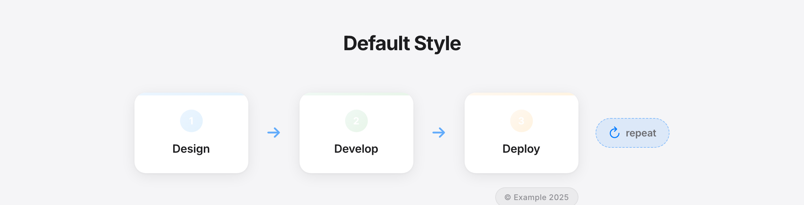
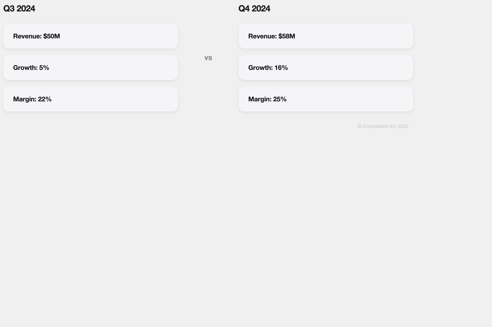
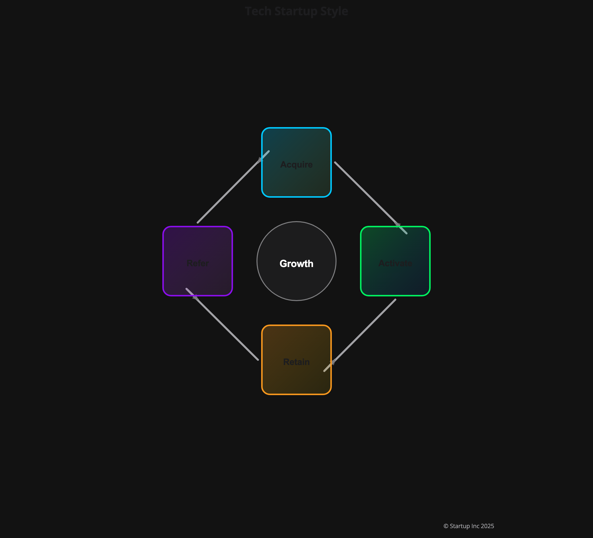
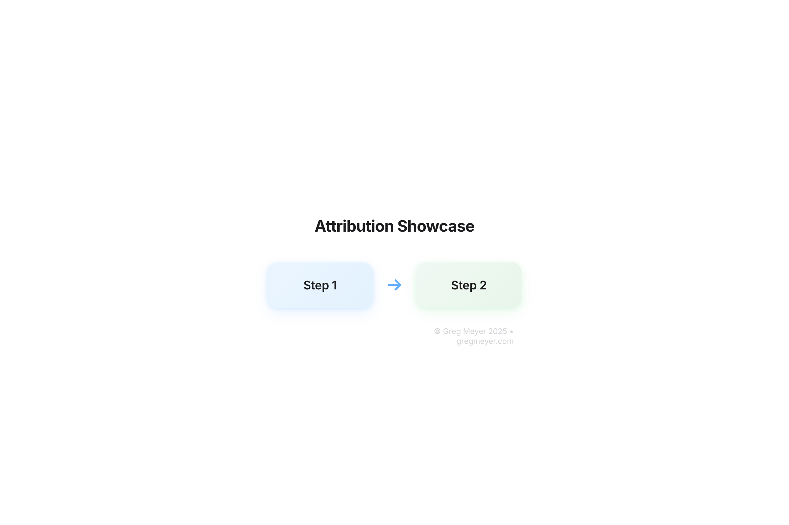
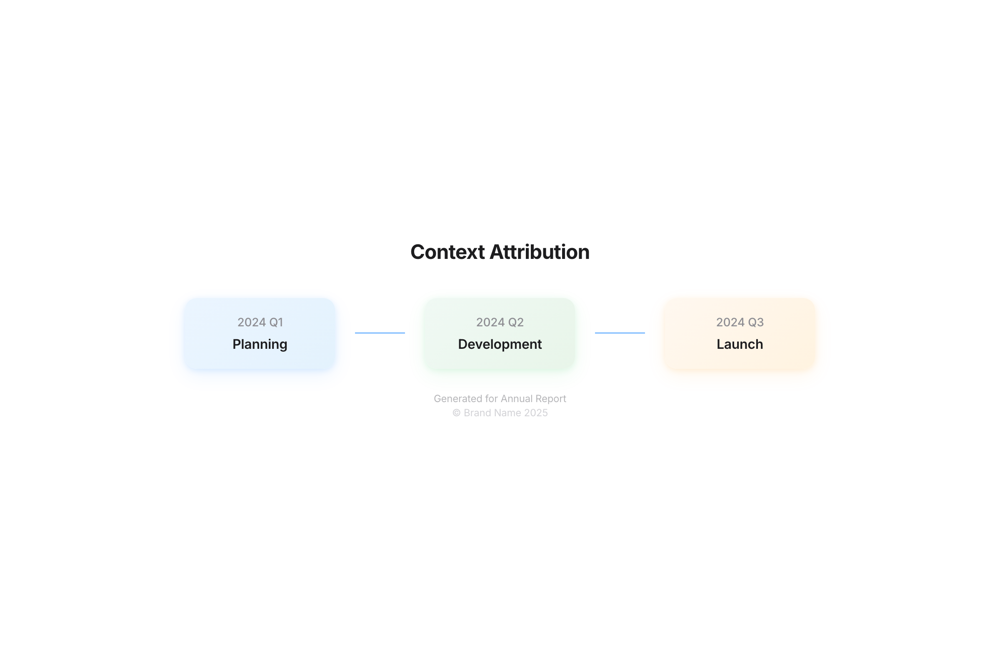

# Core Concepts

Understanding these four concepts will help you use the library effectively.

## 1. The Generator

The `ModernGraphicsGenerator` is the main class that creates graphics. You create one, then use it to generate different diagram types.

```python
from modern_graphics import ModernGraphicsGenerator, Attribution

# Create a generator
generator = ModernGraphicsGenerator(
    title="My Diagram",           # Title for the graphic
    attribution=Attribution()     # Copyright/context info (optional)
)

# Generate different diagram types
html = generator.generate_cycle_diagram([...])
html = generator.generate_comparison_diagram(...)
html = generator.generate_timeline_diagram(...)
# ... and more
```

Key points:
- One generator can create multiple graphics.
- All graphics share the same title and attribution settings.
- Generator methods return HTML that you can export to PNG.

## 2. Diagram Types

The library includes 10+ diagram types, each optimized for different use cases.

Visual gallery:


Choosing the right type: see [Diagram Types Guide](./DIAGRAM_TYPES.md).

## 3. Templates

Templates control the visual style of your graphics: colors, fonts, backgrounds, and overall aesthetic.

Why use templates:
- Consistency: all graphics match your brand.
- Speed: apply styles instantly.
- Flexibility: switch between styles quickly.

Default template:
- Every generator uses a clean default style.

Custom templates:

```python
from modern_graphics import quick_template_from_description

# Generate a template from a description
template = quick_template_from_description(
    "corporate blue and gray, professional, traditional fonts"
)

# Use it
generator = ModernGraphicsGenerator("My Diagram", template=template)
```

Template examples:

| Default | Corporate | Tech Startup |
|---------|-----------|--------------|
|  |  |  |

Learn more: [Advanced Topics](./ADVANCED.md) and [Create Command Guide](./CREATE_COMMAND.md).

## 4. Attribution

Attribution adds copyright and context information to your graphics. It appears at the bottom of generated images.

Default behavior:
- Attribution is included automatically.
- Shows copyright and optional context.
- Positioned at bottom-right by default.

Customize it:

```python
from modern_graphics import Attribution

# Custom attribution
attribution = Attribution(
    copyright="© My Company 2025",
    context="Q4 Report",
    position="bottom-center"
)

generator = ModernGraphicsGenerator("My Diagram", attribution=attribution)
```

Attribution examples:

| Default | Custom Styled | With Context |
|---------|---------------|--------------|
|  |  |  |

Learn more: [API Reference](./API.md) and [Export Guide](./EXPORT.md).
