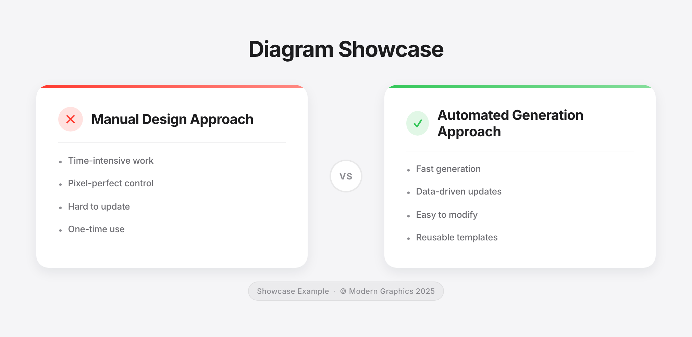
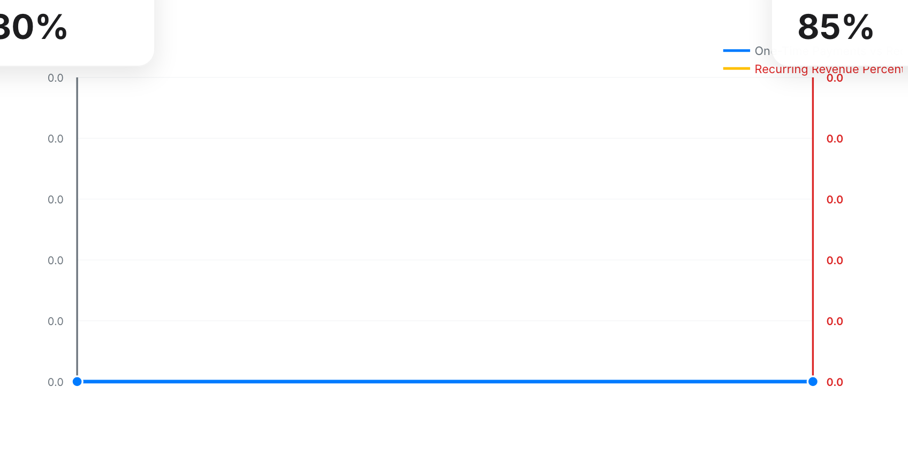
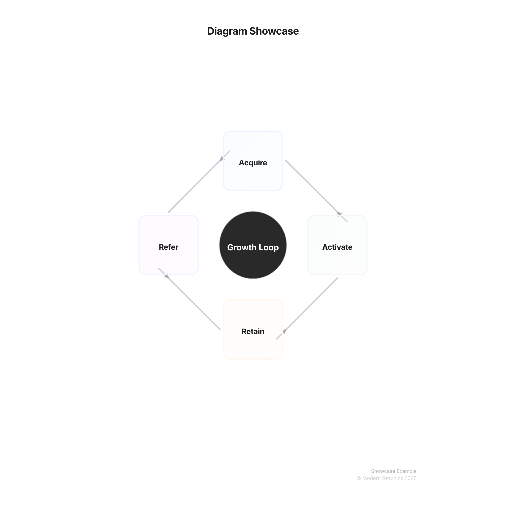
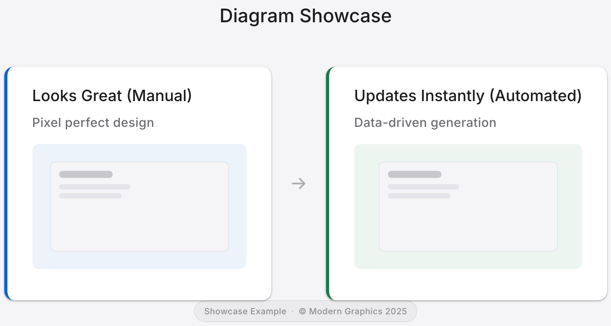

# Diagram Types Guide

## Choosing the Right Diagram Type

Use this decision tree to pick the right diagram for your needs:

```
What do you want to show?
│
├─ Process or Flow?
│  └─ → Cycle Diagram (Plan → Build → Deploy)
│
├─ Comparison?
│  └─ → Comparison Diagram (Option A vs Option B)
│
├─ Timeline or Events?
│  └─ → Timeline Diagram (Q1 → Q2 → Q3)
│
├─ Story or Narrative?
│  └─ → Story Slide (What changed, when, why)
│
├─ List or Priorities?
│  └─ → Grid Diagram (Top 5 items)
│
├─ Hierarchy?
│  └─ → Pyramid Diagram (Executive → Management → Team)
│
├─ Growth Loop?
│  └─ → Flywheel Diagram (Acquire → Activate → Retain)
│
├─ Transformation?
│  └─ → Before/After Diagram (Old → New)
│
├─ Conversion Funnel?
│  └─ → Funnel Diagram (Awareness → Purchase)
│
└─ Multiple Concepts?
   └─ → Slide Cards (Card 1, Card 2, Card 3)
```

## Diagram Types Reference

### Cycle Diagrams
Flow diagrams with connecting arrows, perfect for processes and workflows.


```python
html = generator.generate_cycle_diagram([
    {'text': 'Plan', 'color': 'blue'},
    {'text': 'Build', 'color': 'green'},
    {'text': 'Test', 'color': 'orange'},
    {'text': 'Deploy', 'color': 'purple'}
])
```

**Use cases**: Process flows, workflows, circular dependencies, iterative processes

### Comparison Diagrams
Side-by-side comparisons showing two options or approaches.



```python
html = generator.generate_comparison_diagram(
    left_column={
        'title': 'Manual Approach',
        'steps': ['Time-intensive', 'Pixel perfect', 'Hard to update']
    },
    right_column={
        'title': 'Automated Approach',
        'steps': ['Fast', 'Data-driven', 'Easy updates']
    }
)
```

**Use cases**: Feature comparisons, before/after analysis, pros/cons, decision matrices

### Timeline Diagrams
Horizontal or vertical timelines showing events over time.


```python
html = generator.generate_timeline_diagram(
    events=[
        {'date': '2024 Q1', 'text': 'Launch - Initial release', 'color': 'blue'},
        {'date': '2024 Q2', 'text': 'Growth - User acquisition', 'color': 'green'},
        {'date': '2024 Q3', 'text': 'Scale - Expansion', 'color': 'orange'}
    ],
    orientation='horizontal'  # or 'vertical'
)
```

**Use cases**: Project timelines, historical events, roadmap visualization, milestones

### Story Slides
Narrative-driven slides focusing on "What changed?", "Over what time period?", and "What does it mean?"



```python
html = generator.generate_story_slide(
    title="The Transformation",
    what_changed="Revenue model shifted from one-time to recurring",
    time_period="Q2-Q4 2024",
    what_it_means="Predictable revenue and better customer relationships"
)
```

**Use cases**: Data-driven stories, transformation narratives, key insights, executive summaries

### Grid Diagrams
Numbered grid layouts for ordered lists or feature grids.


```python
html = generator.generate_grid_diagram(
    items=[
        {'number': '1', 'text': 'First priority'},
        {'number': '2', 'text': 'Second priority'},
        {'number': '3', 'text': 'Third priority'}
    ]
)
```

**Use cases**: Prioritized lists, feature grids, numbered steps, top N lists

### Flywheel Diagrams
Circular flywheel diagrams showing reinforcing loops.



```python
html = generator.generate_flywheel_diagram(
    elements=[
        {'text': 'Acquire', 'color': 'blue'},
        {'text': 'Activate', 'color': 'green'},
        {'text': 'Retain', 'color': 'orange'},
        {'text': 'Refer', 'color': 'purple'}
    ]
)
```

**Use cases**: Growth loops, business models, reinforcing cycles, system dynamics

### Slide Cards
Presentation card layouts for multiple related concepts.


```python
html = generator.generate_slide_card_diagram(
    cards=[
        {'title': 'Card 1', 'tagline': 'Subtitle 1', 'subtext': 'Description 1'},
        {'title': 'Card 2', 'tagline': 'Subtitle 2', 'subtext': 'Description 2'},
        {'title': 'Card 3', 'tagline': 'Subtitle 3', 'subtext': 'Description 3'}
    ]
)
```

**Use cases**: Presentation slides, feature cards, product showcases, concept grids

### Slide Card Comparison
Side-by-side comparison of two slide cards.



```python
html = generator.generate_slide_card_comparison(
    left_card={'title': 'Looks Great', 'tagline': 'Manual', 'subtext': 'Pixel perfect design'},
    right_card={'title': 'Updates Instantly', 'tagline': 'Automated', 'subtext': 'Data-driven generation'}
)
```

**Use cases**: Before/after comparisons, feature comparisons, transformation visualizations

### Funnel Diagrams
Stacked funnels highlighting drop-off across stages (tracked PNG lives in the theme demo assets).


```python
funnel = [
    {"text": "Awareness", "value": 1500, "color": "blue"},
    {"text": "Consideration", "value": 800, "color": "green"},
    {"text": "Evaluation", "value": 400, "color": "orange"},
    {"text": "Purchase", "value": 200, "color": "purple"}
]
html = generator.generate_funnel_diagram(funnel)
```

**Use cases**: Marketing funnels, hiring pipelines, conversion drop-off, lead qualification

### Pyramid Diagrams
Layered hierarchies for priorities or org structures.


```python
layers = [
    {"text": "Vision"},
    {"text": "Strategy"},
    {"text": "Execution"},
    {"text": "Impact"}
]
html = generator.generate_pyramid_diagram(layers)
```

**Use cases**: Priority stacks, org hierarchies, Maslow-style pyramids, GTM tiers

### Timeline (Compact) & Variants
Want variations beyond the default PNGs? Run `python examples/generate_complete_theme_demo.py` to regenerate the latest themed outputs (timeline, funnel, pyramid, hero canvas cards, and more) under `examples/output/theme-demo/`.

### Radar Diagram
Need radial comparison views? See [Radar Diagram Guide](RADAR_DIAGRAM.md) for usage and examples.

### Additional CLI Layouts

The following supported layouts are currently exposed as dedicated CLI commands (not `create` layouts):

- `before-after`
- `slide-cards`
- `slide-compare`
- `premium-card`

See [Create Command Guide](CREATE_COMMAND.md#cli-only-layouts-outside-create) for copy/paste command recipes.
