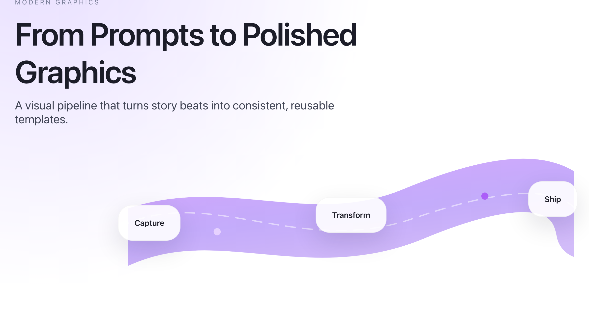
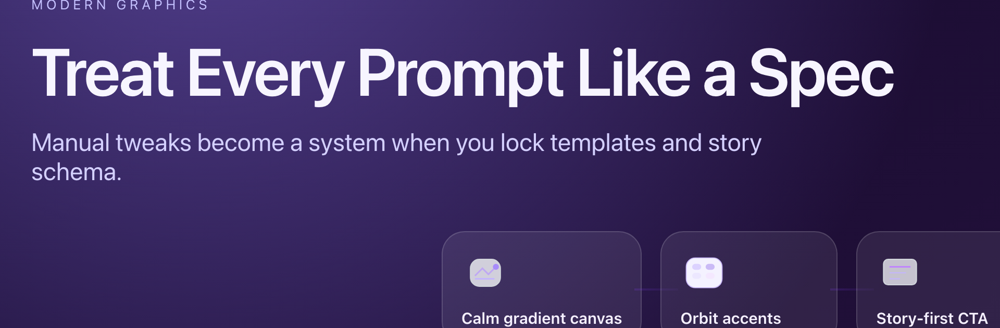

# Hero Slides Guide

Modern hero slides render Apple-style layouts with calm gradients, orbit accents, and structured triptychs. Each layout was designed around a narrative prompt so you can quickly "describe the slide" before rendering.

## Quick Examples

| Tiles Layout | Flowchart Layout | Custom SVG Layout |
|--------------|------------------|-------------------|
|  |  |  |

| Dark Variant | Triptych Layout |
|--------------|-----------------|
|  |  |

**Note:** The Custom SVG Layout example uses a freeform canvas with a custom SVG ribbon illustration. See [Freeform Canvas](#freeform-canvas) section below for complete examples.

## 1. Modern Hero (Open Canvas)

### Basic Usage

**Python:**
```python
from pathlib import Path
from modern_graphics import ModernGraphicsGenerator, Attribution

generator = ModernGraphicsGenerator("Hero Slide", Attribution())
html = generator.generate_modern_hero(
    headline="Build a Graphics System, Not Just Slides",
    subheadline="Route every story beat through templates so each visual ships with intent.",
    eyebrow="Modern Graphics",
    highlight_tiles=[
        {"label": "Capture story beat", "icon": "manual"},
        {"label": "Map to template", "icon": "templates"},
        {"label": "Paste prompt + numbers", "icon": "generated"},
        {"label": "Ship hero visuals", "icon": "generated"}
    ],
    stats=[
        {"label": "Design time", "value": "2h → 5m"},
        {"label": "Consistency", "value": "Low → High"},
        {"label": "Reusability", "value": "One-off → Regenerate"}
    ],
    cta="Templates are visual infrastructure",
    background_variant="light"
)
generator.export_to_png(html, Path("hero.png"), viewport_width=1700, viewport_height=1100, padding=30)
```

**CLI:**
```bash
python -m modern_graphics.cli modern-hero \
  --title "Build Presentation Graphics" \
  --headline "Build a Graphics System, Not Just Slides" \
  --subheadline "Route every story beat through templates so each visual ships with intent." \
  --highlights "Capture story beat,Map to template,Paste prompt + numbers,Ship hero visuals" \
  --stats "Design time:2h → 5m,Consistency:Low → High,Reusability:One-off → Regenerate" \
  --cta "Templates are visual infrastructure" \
  --output hero.png --png
```

## 2. Modern Hero (Dark Variant)

**Python:**
```python
html = generator.generate_modern_hero(
    headline="Treat Every Prompt Like a Spec",
    subheadline="Manual tweaks become a system when you lock templates and story schema.",
    eyebrow="Modern Graphics",
    highlight_tiles=[
        {"label": "Calm gradient canvas", "icon": "generated"},
        {"label": "Orbit accents", "icon": "templates"},
        {"label": "Story-first CTA", "icon": "manual"}
    ],
    stats=[
        {"label": "Design time", "value": "2h → 5m"},
        {"label": "Consistency", "value": "Low → High"}
    ],
    background_variant="dark"
)
```

## 3. Modern Hero Triptych

**Python:**
```python
html = generator.generate_modern_hero_triptych(
    headline="From Prompts to Polished Slides",
    subheadline="Manual decks become a reusable pipeline when every beat flows through templates.",
    eyebrow="Modern Graphics",
    columns=[
        {
            "title": "Manual design",
            "items": ["Ad-hoc layouts", "Inconsistent styling", "Hours per slide"],
            "icon": "manual"
        },
        {
            "title": "Template library",
            "items": ["Story slide schema", "Data cards", "Prompt recipes"],
            "icon": "templates"
        },
        {
            "title": "Generated visuals",
            "items": ["Deterministic output", "Repeatable quality", "Deck-ready assets"],
            "icon": "generated"
        }
    ],
    stats=[
        {"label": "Design time", "value": "2h → 5m"},
        {"label": "Consistency", "value": "Low → High"},
        {"label": "Reusability", "value": "One-off → Regenerate"}
    ]
)
```

**CLI:**
```bash
python -m modern_graphics.cli modern-hero-triptych \
  --title "Build Presentation Graphics" \
  --headline "From prompts to polished slides" \
  --subheadline "Manual decks become a reusable pipeline when every beat flows through templates." \
  --columns '[{"title":"Manual design","items":["Ad-hoc layouts","Inconsistent styling","Hours per slide"],"icon":"manual"},{"title":"Template library","items":["Story slide schema","Data cards","Prompt recipes"],"icon":"templates"},{"title":"Generated visuals","items":["Deterministic output","Repeatable quality","Deck-ready assets"],"icon":"generated"}]' \
  --stats "Design time:2h → 5m,Consistency:Low → High,Reusability:One-off → Regenerate" \
  --output hero-triptych.png --png
```

## Prompt-Driven Hero Utility

If you prefer to describe the hero via a prompt file, drop JSON like this into `hero_prompt.json`:

```json
{
  "layout": "triptych",
  "headline": "Build a Graphics System, Not Just Slides",
  "subheadline": "Manual tweaks become a reusable pipeline when every beat flows through templates.",
  "eyebrow": "Modern Graphics",
  "highlights": ["Capture story beat", "Map to template", "Paste prompt + numbers", "Ship hero visuals"],
  "stats": [
    {"label": "Design time", "value": "2h → 5m"},
    {"label": "Consistency", "value": "Low → High"},
    {"label": "Reusability", "value": "One-off → Regenerate"}
  ],
  "columns": [
    {"title": "Manual design", "items": ["Ad-hoc layouts", "Inconsistent styling", "Hours per slide"], "icon": "manual"},
    {"title": "Template library", "items": ["Story slide schema", "Data cards", "Prompt recipes"], "icon": "templates"},
    {"title": "Generated visuals", "items": ["Deterministic output", "Repeatable quality", "Deck-ready assets"], "icon": "generated"}
  ]
}
```

Then run:
```bash
python -m modern_graphics.cli modern-hero-prompt \
  --prompt-file hero_prompt.json \
  --output hero-from-prompt.png --png
```

Set `"layout": "open"` and omit `columns` to get the open-canvas variant.

## Visual Options

### Highlight Tiles

Open layouts support structured `highlight_tiles` (JSON array with `label` + optional `icon`). When provided, the hero renders a visual flow of icon tiles instead of a text pill list.

```python
highlight_tiles=[
    {"label": "Capture story beat", "icon": "manual"},
    {"label": "Map to template", "icon": "templates"},
    {"label": "Ship visuals", "icon": "generated"}
]
```

### Visual Description

You can pass a `visual_description` string (e.g., "Render a curved arrow linking three icon tiles, glassmorphism background") — the generator looks for keywords like "curved arrow" or "glassmorphism" and toggles extra flourishes (flow arrows, blurred backgrounds) automatically.

**Supported Keywords:**
- `curved arrow`, `curved flow` - Adds curved flow arrows
- `constellation`, `floating arc`, `open orbit`, `s-curve` - Adds constellation flow
- `glass`, `glassmorphism` - Adds glassmorphism effect
- `warm`, `sunrise`, `amber`, `gold` - Adds warm color palette
- `ribbon`, `collage`, `bezier` - Adds ribbon collage

## Flow Nodes (Open Layout)

When you need a freeform flowchart instead of evenly stacked tiles, describe the hero's visual in terms of nodes and arcs:

```json
{
  "layout": "open",
  "headline": "Diagnose the knowledge base like a DAG",
  "flow_nodes": [
    {"id": "bot", "label": "Bot answer feels off", "icon": "warning", "position": {"x": 0.08, "y": 0.58}, "size": "small"},
    {"id": "context", "label": "Context", "icon": "manual", "orbit": "top"},
    {"id": "atomic", "label": "Atomic content", "icon": "templates", "orbit": "bottom"},
    {"id": "breadcrumbs", "label": "Breadcrumbs", "icon": "generated", "orbit": "top"},
    {"id": "trust", "label": "Trustworthy output", "icon": "generated", "position": {"x": 0.9, "y": 0.55}}
  ],
  "flow_connections": [
    {"from": "bot", "to": "context"},
    {"from": "bot", "to": "atomic"},
    {"from": "bot", "to": "breadcrumbs"},
    {"from": "context", "to": "trust"},
    {"from": "atomic", "to": "trust"},
    {"from": "breadcrumbs", "to": "trust"}
  ],
  "visual_description": "Floating constellation DAG with translucent arcs, directed acrylic graph energy."
}
```

Each node may provide normalized `x` / `y` coordinates (0→1) or use `orbit` hints (`top`, `center`, `bottom`). Connections default to sequential links, but you can declare explicit `{ "from": "node-id", "to": "node-id" }` edges for branching DAGs.

## Freeform Canvas

Need total control? Pass raw HTML/SVG through the `freeform_canvas` field (or `--freeform-canvas` CLI flag) and it will be injected ahead of the highlight area.

### Example: Custom SVG Ribbon

```python
from pathlib import Path
from modern_graphics import ModernGraphicsGenerator, Attribution

generator = ModernGraphicsGenerator("Hero Slide", Attribution())

# Create custom SVG ribbon illustration
freeform_svg = """<div style="position:relative;height:320px;display:flex;justify-content:center;align-items:center;">
  <svg viewBox="0 0 1000 320" xmlns="http://www.w3.org/2000/svg" style="width:100%;max-width:900px;">
    <defs>
      <linearGradient id="ribbonGrad" x1="0%" y1="0%" x2="100%" y2="100%">
        <stop offset="0%" stop-color="#C084FC" stop-opacity="0.8"/>
        <stop offset="50%" stop-color="#8B5CF6" stop-opacity="0.6"/>
        <stop offset="100%" stop-color="#7C3AED" stop-opacity="0.4"/>
      </linearGradient>
    </defs>
    <path d="M-20 200 C 200 100, 400 240, 640 140 S 1000 60, 1020 180" 
          stroke="url(#ribbonGrad)" stroke-width="120" fill="none" stroke-linecap="round" opacity="0.85"/>
    <path d="M-20 170 C 180 70, 380 240, 640 150 S 1000 90, 1020 160" 
          stroke="rgba(255,255,255,0.5)" stroke-dasharray="24 14" stroke-width="3" fill="none"/>
    <circle cx="200" cy="180" r="8" fill="#E9D5FF" opacity="0.9"/>
    <circle cx="500" cy="140" r="10" fill="#C084FC" opacity="0.8"/>
    <circle cx="800" cy="100" r="8" fill="#A855F7" opacity="0.9"/>
  </svg>
  <div class="canvas-chip" style="position:absolute;left:20%;top:50%;transform:translate(-50%,-50%);">Capture</div>
  <div class="canvas-chip" style="position:absolute;left:50%;top:45%;transform:translate(-50%,-50%);">Transform</div>
  <div class="canvas-chip" style="position:absolute;left:80%;top:35%;transform:translate(-50%,-50%);">Ship</div>
</div>"""

html = generator.generate_modern_hero(
    headline="From Prompts to Polished Graphics",
    subheadline="A visual pipeline that turns story beats into consistent, reusable templates.",
    eyebrow="Modern Graphics",
    freeform_canvas=freeform_svg,
    stats=[
        {"label": "Speed", "value": "2h → 5m"},
        {"label": "Quality", "value": "Consistent"},
        {"label": "Reusability", "value": "Infinite"}
    ],
    background_variant="light"
)

generator.export_to_png(html, Path("hero-svg.png"), viewport_width=1700, viewport_height=1100, padding=30)
```

### Example: SVG.js Custom Illustration

For more complex programmatic SVG, use SVG.js:

```python
from pathlib import Path
from modern_graphics import ModernGraphicsGenerator, Attribution
from modern_graphics.svg_utils import generate_svg_init_script, generate_svg_container

generator = ModernGraphicsGenerator("Hero Slide", Attribution(), use_svg_js=True)

# Create SVG.js illustration code
svg_js_code = """
// Create gradient
const gradient = draw.gradient('linear', function(stop) {
    stop.at(0, '#C084FC')
    stop.at(1, '#7C3AED')
})

// Draw curved ribbon path
const ribbon = draw.path('M 50 200 Q 300 100, 550 150 T 950 120')
    .stroke({color: gradient, width: 80})
    .fill('none')
    .opacity(0.7)

// Add nodes along the path
const nodes = [
    {x: 150, y: 180, label: 'Capture'},
    {x: 450, y: 140, label: 'Transform'},
    {x: 750, y: 110, label: 'Ship'}
]

nodes.forEach(node => {
    draw.circle(60)
        .move(node.x - 30, node.y - 30)
        .fill('#FFFFFF')
        .stroke({color: '#C084FC', width: 3})
        .opacity(0.9)
    
    draw.text(node.label)
        .move(node.x, node.y + 50)
        .font({size: 18, weight: 'bold', anchor: 'middle'})
        .fill('#1F2937')
})
"""

# Create container and script
container = generate_svg_container("hero-svg", 1000, 320)
script = generate_svg_init_script("hero-svg", 1000, 320, svg_js_code)

# Wrap in freeform canvas
freeform_canvas = f"""
<div style="position:relative;height:320px;width:100%;">
    {container}
    {script}
</div>
"""

html = generator.generate_modern_hero(
    headline="Custom SVG.js Illustration",
    subheadline="Create dynamic, programmatic SVG graphics in your hero slides.",
    eyebrow="Advanced",
    freeform_canvas=freeform_canvas,
    stats=[
        {"label": "Flexibility", "value": "Total"},
        {"label": "Complexity", "value": "Unlimited"}
    ]
)

generator.export_to_png(html, Path("hero-svgjs.png"), viewport_width=1700, viewport_height=1100, padding=30)
```

### Canvas Chip Helper

The injected block inherits hero themes (`hero-dark`, `hero-warm`) and ships with helper styles (`.canvas-chip`). Use canvas chips for labels:

```html
<div class="canvas-chip" style="position:absolute;left:25%;top:40%;transform:translate(-50%,-50%);">
    Your Label
</div>
```

Canvas chips automatically style based on the hero theme (light/dark/warm).

### Tips

- Use SVG paths for smooth curves and complex shapes
- Combine with gradients for visual depth
- Use `.canvas-chip` helper for consistent label styling
- Match SVG colors to hero theme for cohesion
- Keep SVG viewBox dimensions reasonable (1000-1200px width works well)

## Parameters

### generate_modern_hero()

- `headline` (str, required) - Main headline text
- `subheadline` (str, optional) - Subheadline text
- `eyebrow` (str, optional) - Small label above headline
- `highlights` (List[str], optional) - List of highlight text items
- `highlight_tiles` (List[Dict], optional) - List of tiles with `label` and `icon`
- `flow_nodes` (List[Dict], optional) - Flowchart nodes
- `flow_connections` (List[Dict], optional) - Flowchart connections
- `freeform_canvas` (str, optional) - Raw HTML/SVG for custom canvas
- `stats` (List[Dict], optional) - Statistics to display
- `cta` (str, optional) - Call-to-action text
- `background_variant` (str, default="light") - "light" or "dark"
- `visual_description` (str, optional) - Description for visual effects

### generate_modern_hero_triptych()

- `headline` (str, required) - Main headline text
- `subheadline` (str, required) - Subheadline text
- `columns` (List[Dict], required) - List of 3 column dictionaries with `title`, `items`, `icon`
- `stats` (List[Dict], optional) - Statistics to display
- `eyebrow` (str, optional) - Small label above headline

## Tips

- Each prompt focuses on the story ("what changed, when, why it matters") so the hero conveys more than decoration
- Use `highlight_tiles` for visual icon-based highlights
- Use `flow_nodes` for flowchart/DAG visualizations
- Use `freeform_canvas` for complete custom control
- Visual descriptions trigger automatic styling based on keywords
