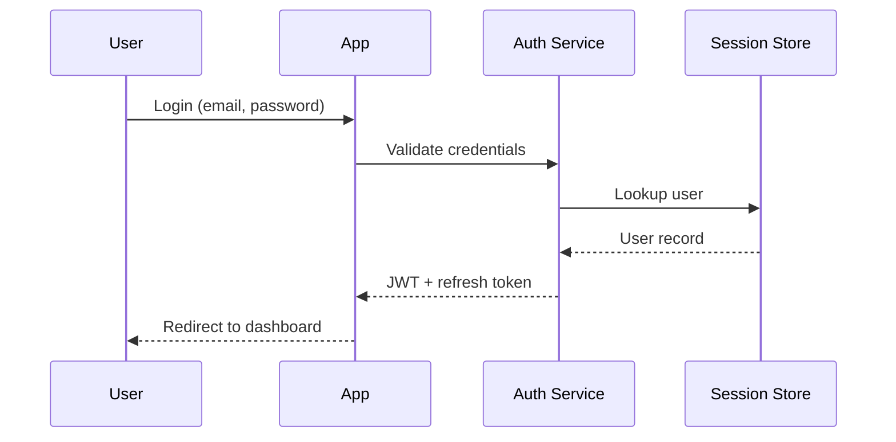

# Mermaid diagrams in cards and hero

Yes — you can take a Mermaid diagram, output it to SVG, and have that SVG show up in a **card** or a **hero** image.

## Flow

1. **Mermaid → SVG**  
   Use the Mermaid CLI (`@mermaid-js/mermaid-cli`) or [Mermaid Live](https://mermaid.live) to render your diagram to SVG.
2. **SVG → layout**  
   Pass the SVG string into the layout that supports custom graphics.

## Where SVG is accepted

| Layout | Parameter | Notes |
|--------|-----------|--------|
| **Slide card** | `custom_mockup` (per card) | Card dict: `{"title": "...", "custom_mockup": svg_string}` |
| **Insight card** | `svg_content` | `generate_insight_card(generator, text="...", svg_content=svg_string)` |
| **Modern hero** | `freeform_canvas` | `generate_modern_hero(..., freeform_canvas=svg_string)` |

So: **Mermaid → SVG → card or hero** works by passing that SVG into `custom_mockup`, `svg_content`, or `freeform_canvas`.

## Getting SVG from Mermaid

### Option A: Mermaid CLI (mmdc)

Install the Mermaid CLI, then use the helper:

```bash
npm install -g @mermaid-js/mermaid-cli
```

```python
from modern_graphics.diagrams.mermaid_svg import mermaid_to_svg

mermaid_source = """
flowchart LR
  A[Start] --> B[Process]
  B --> C[End]
"""
svg_string = mermaid_to_svg(mermaid_source)
# Use svg_string as custom_mockup, svg_content, or freeform_canvas
```

If the CLI is not installed, `mermaid_to_svg` raises `RuntimeError` with instructions.

### Option B: Pre-rendered SVG

Render your diagram at [mermaid.live](https://mermaid.live) (or any Mermaid renderer), download SVG, then pass its content:

```python
from pathlib import Path

svg_string = Path("diagram.svg").read_text()
# Use svg_string as custom_mockup, svg_content, or freeform_canvas
```

### Option C: npx (no global install)

The helper uses `npx -y @mermaid-js/mermaid-cli mmdc` by default, so a global install is not required if `npx` is available.

## Example: Insight card with Mermaid

```python
from modern_graphics import ModernGraphicsGenerator, Attribution
from modern_graphics.diagrams import generate_insight_card
from modern_graphics.diagrams.mermaid_svg import mermaid_to_svg

generator = ModernGraphicsGenerator("Demo", attribution=Attribution(copyright="© 2025"))
mermaid = "flowchart LR\n  A --> B --> C"
svg = mermaid_to_svg(mermaid)
html = generate_insight_card(
    generator,
    text="The process flows in one direction.",
    svg_content=svg,
    svg_label="Flow",
)
generator.save(html, "insight_with_mermaid.html")
```

## Example: Hero with Mermaid

```python
from modern_graphics import ModernGraphicsGenerator, Attribution
from modern_graphics import generate_modern_hero
from modern_graphics.diagrams.mermaid_svg import mermaid_to_svg

generator = ModernGraphicsGenerator("Demo", attribution=Attribution(copyright="© 2025"))
mermaid = "flowchart LR\n  X --> Y --> Z"
svg = mermaid_to_svg(mermaid)
html = generate_modern_hero(
    generator,
    headline="Your headline",
    subheadline="Supporting line",
    freeform_canvas=svg,
)
generator.save(html, "hero_with_mermaid.html")
```

## Example: sequence diagram of authentication in a hero card

A common use case is showing an **authentication sequence diagram** (participants and messages over time) in a hero card. Use Mermaid’s **sequenceDiagram** (participants with horizontal message arrows), not a flowchart (`flowchart LR` / `flowchart TD`).

**Mermaid file** (e.g. `examples/auth_sequence.mmd`) — must start with `sequenceDiagram` and use `participant` and `->>` / `-->>`:



**CLI** — render the diagram into the hero body:

```bash
modern-graphics modern-hero \
  --title "Authentication" \
  --headline "How login works" \
  --subheadline "User, app, and auth service in one flow." \
  --mermaid-file examples/auth_sequence.mmd \
  --output hero_auth.html
```

With PNG export:

```bash
modern-graphics modern-hero \
  --title "Authentication" \
  --headline "How login works" \
  --subheadline "User, app, and auth service in one flow." \
  --mermaid-file examples/auth_sequence.mmd \
  --output hero_auth.png --png
```

**Python** — same flow from code:

```python
from pathlib import Path
from modern_graphics import ModernGraphicsGenerator, Attribution
from modern_graphics.diagrams.modern_hero import generate_modern_hero
from modern_graphics.diagrams.mermaid_svg import mermaid_to_svg

generator = ModernGraphicsGenerator("Auth flow", attribution=Attribution(copyright="© 2025"))
mermaid = Path("examples/auth_sequence.mmd").read_text()
svg = mermaid_to_svg(mermaid)
html = generate_modern_hero(
    generator,
    headline="How login works",
    subheadline="User, app, and auth service in one flow.",
    freeform_canvas=svg,
)
generator.save(html, "hero_auth.html")
```

The repo includes `examples/auth_sequence.mmd` (full login + token flow) and `examples/hero_auth_sequence.py` to generate the hero from it.

## Theme: honor your color scheme in the diagram

Mermaid doesn't support arbitrary themes directly; we apply your **theme** by passing a Mermaid config file (theme `base` + `themeVariables`) derived from your ColorScheme. The diagram then uses your scheme's primary, backgrounds, text and line colors, and font.

**Python** — pass `color_scheme` to `mermaid_to_svg`:

```python
from modern_graphics import get_scheme
from modern_graphics.diagrams.mermaid_svg import mermaid_to_svg

scheme = get_scheme("apple")  # or "dark", "arcade", etc.
svg = mermaid_to_svg(mermaid_source, color_scheme=scheme)
```

**CLI** — use `--theme` when rendering Mermaid:

```bash
modern-graphics mermaid --input diagram.mmd --output diagram.svg --theme apple
modern-graphics insight-card --text "Insight" --mermaid-file diagram.mmd --theme apple --output card.html
modern-graphics modern-hero --title "Auth" --headline "Flow" --mermaid-file auth.mmd --theme dark --output hero.html
```

Mapping: we set Mermaid's `theme` to `base` and fill `themeVariables` from your scheme (e.g. `primaryColor`, `background`, `textColor`, `lineColor`, `fontFamily`, and sequence-diagram variables like `actorBkg`, `signalColor`). Dark mode is inferred from background luminance.

## Customizing the diagram font (with theme)

Use the theme so the diagram gets your scheme's colors and font; optionally override the font:

**Python** — pass `color_scheme` and optionally `font_family`:

```python
from modern_graphics import get_scheme
from modern_graphics.diagrams.mermaid_svg import mermaid_to_svg

# Theme (colors + scheme font)
scheme = get_scheme("apple")
svg = mermaid_to_svg(mermaid_source, color_scheme=scheme)

# Theme + override font
svg = mermaid_to_svg(mermaid_source, color_scheme=scheme, font_family="Georgia, serif")
```

**CLI** — use `--theme` and optionally `--font` or `--mermaid-font`:

```bash
modern-graphics mermaid --input diagram.mmd --output diagram.svg --theme apple
modern-graphics mermaid --input diagram.mmd --output diagram.svg --theme apple --font "Georgia, serif"
modern-graphics modern-hero --headline "Flow" --mermaid-file auth.mmd --theme dark --mermaid-font "Inter, sans-serif"
```

Font-only (no theme) is also supported: omit `--theme` and pass `--font` so only the diagram font is set.

## Summary

- **Cards and hero both accept custom SVG.**  
- **Mermaid → SVG** via `mermaid_to_svg()` (needs Mermaid CLI) or any external renderer.  
- **Theme:** pass `color_scheme` (or use `--theme` on the CLI) so the diagram uses your scheme's colors and font.  
- **Pass that SVG** into `custom_mockup` (slide card), `svg_content` (insight card), or `freeform_canvas` (modern hero).
