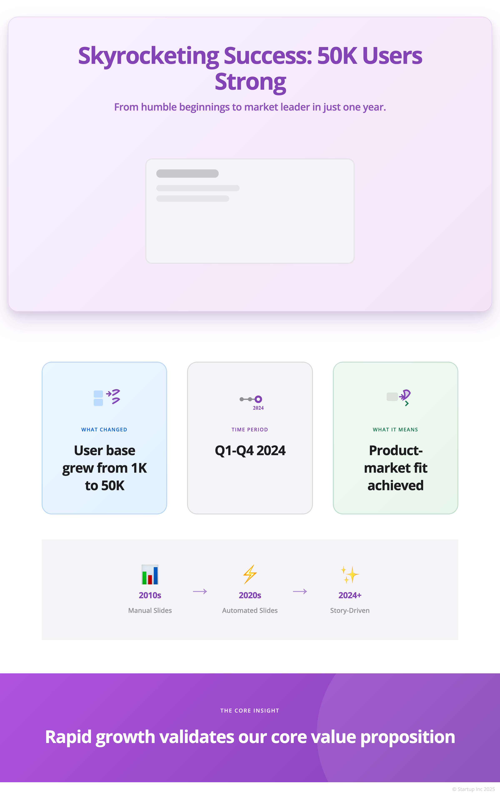

# Common Use Cases

Practical examples for real-world scenarios.

## Quick Graphics

Generate graphics fast using convenience functions:

```python
from modern_graphics import generate_cycle_diagram

# Generate directly without creating a generator
html = generate_cycle_diagram([
    {'text': 'Step 1', 'color': 'blue'},
    {'text': 'Step 2', 'color': 'green'}
])
```

## Custom Styling

Apply your brand colors and fonts:

```python
from modern_graphics import quick_template_from_description

# Create a template matching your brand
template = quick_template_from_description(
    "dark theme with blue accents, modern sans-serif"
)

generator = ModernGraphicsGenerator("My Diagram", template=template)
```

## Batch Generation

Generate multiple graphics efficiently:

```python
from pathlib import Path
from modern_graphics import ModernGraphicsGenerator, Attribution

generator = ModernGraphicsGenerator("Batch", Attribution())
output_dir = Path("output")
output_dir.mkdir(exist_ok=True)

# Generate multiple diagrams
for i, data in enumerate(my_data_list):
    html = generator.generate_cycle_diagram(data)
    generator.export_to_png(html, output_dir / f"diagram_{i}.png")
```

## Export Options

Control resolution and quality:

```python
# High-resolution for print
generator.export_to_png(
    html, 
    Path('output.png'),
    viewport_width=3200,
    device_scale_factor=3
)

# Standard quality (default)
generator.export_to_png(html, Path('output.png'))
```

## Use Case Examples

**Corporate Quarterly Report:**


**Tech Startup Pitch Deck:**



**Educational Course Materials:**


See the [Examples](../README.md#examples) section in the full documentation for complete use case implementations.
