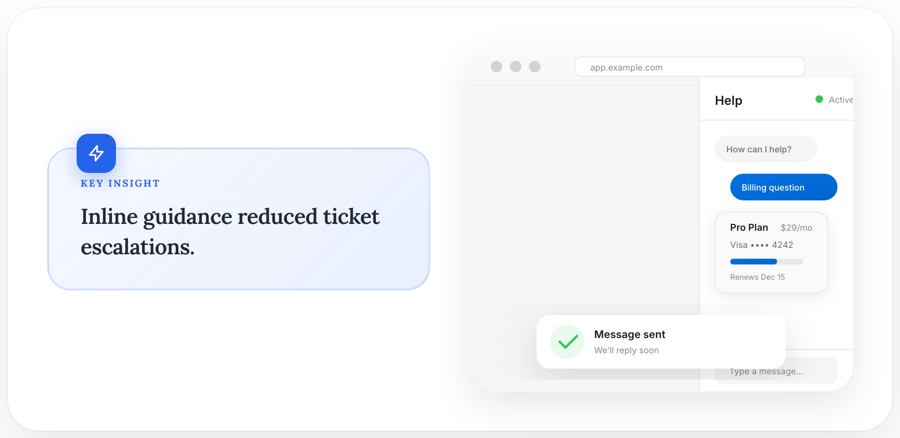
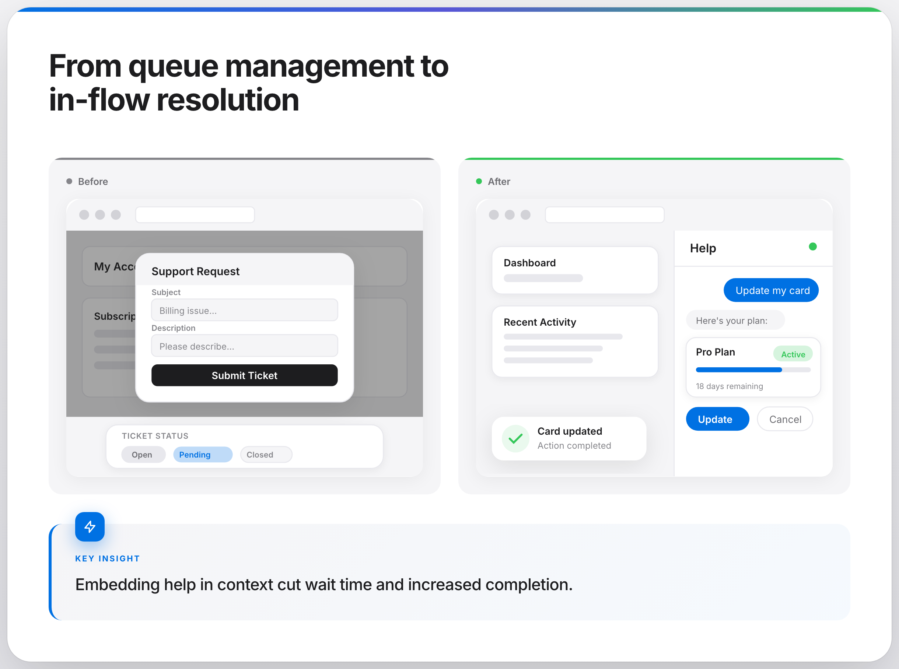

# Wireframe Scene Specification

The scene-spec wireframe renderer composes SVG from a declarative spec: either a **preset name** (`before`, `after`) or a **custom spec** (JSON) with `width`, `height`, and a list of **elements**. Each element has a `type`, position (`x`, `y`), optional size (`width`, `height`), and optional `props` for that type.

## Spec format

```json
{
  "width": 800,
  "height": 520,
  "elements": [
    {
      "type": "browser_window",
      "x": 0,
      "y": 0,
      "width": 800,
      "height": 520,
      "props": { "url": "app.example.com" }
    },
    {
      "type": "modal",
      "x": 260,
      "y": 120,
      "width": 280,
      "height": 320,
      "props": {
        "title": "Support Request",
        "fields": [
          { "label": "Subject" },
          { "label": "Description", "textarea": true }
        ],
        "submit_text": "Submit"
      }
    }
  ]
}
```

- **width** (number): Scene SVG width. Default: 600.
- **height** (number): Scene SVG height. Default: 520.
- **elements** (array): List of element objects.

### Element object

- **type** (string, required): One of the registered element types (see below).
- **x**, **y** (number): Position in scene. Default: 0.
- **width**, **height** (number, optional): Passed into the element; required for some types.
- **props** (object, optional): Type-specific options. Merged with element-level width/height.

## Presets

| Preset   | Description |
|----------|-------------|
| `before` | Support flow: browser + modal overlay + support request modal + ticket status flow. |
| `after`  | App with in-app help: browser + chat panel + success toast. |

Use a preset by passing the name (e.g. `"before"`) instead of a full spec to `render_scene()` or the CLI.

## Element types and props

| Type                | Description | Props |
|---------------------|-------------|--------|
| **browser_window**  | Full browser window with chrome and content area. | `url` (string, default `"app.example.com"`), `content_bg` (optional fill), `width`, `height` (from element or props). |
| **browser_chrome** | Browser chrome bar only. | `url` (string), `width` (from element or props). |
| **modal**          | Modal dialog with title, form fields, submit button. | `title` (string), `fields` (list of `{ "label": "...", "textarea": true }`), `submit_text` (string, default `"Submit"`), `width`, `height`. |
| **modal_overlay**  | Semi-transparent overlay. | `opacity` (number, default 0.25), `width`, `height` (required). |
| **chat_panel**     | Chat UI with header, messages, optional inline card and buttons. | `header_title` (string, default `"Help"`), `messages` (list of `{ "text": "...", "is_user": bool }`), `inline_card` (e.g. `{ "title": "...", "subtitle": "..." }`), `action_buttons` (list of button labels or `{ "text", "primary" }`), `quick_actions` (list of strings), `show_active_status` (bool, default true), `width`, `height`. |
| **content_card**   | Card with optional skeleton lines and divider. | `line_widths` (list of 0–1 ratios), `show_divider` (bool, default false), `opacity` (number, default 1.0), `width`, `height`. |
| **app_header**     | App bar / header strip. | `width`, `height`. |
| **success_toast**  | Toast notification. | `title` (string), `subtitle` (string), `width`, `height`. |
| **status_pill**    | Pill badge (e.g. status). | `text` (string), `status` (`"neutral"` \| `"success"` \| `"error"`), `icon` (bool, default true). |
| **ticket_status_flow** | Horizontal ticket/workflow status steps. | `statuses` (list of step labels), `active_index` (int, default 1), `ticket_id` (string), `estimated_time` (string). |
| **skeleton_lines** | Placeholder lines (loading skeleton). | `widths` (list of 0–1 ratios, default `[0.9, 0.7, 0.5]`), `line_height` (number), `gap` (number). |
| **transaction** | Credit-card-style transaction (icons + merchant, amount, date). | `merchant` (string), `amount` (string), `date` (string), `width`, `height`. Colors come from scene config. |

## Usage

### Python

```python
from modern_graphics.diagrams.wireframe_scene import render_scene, list_presets, list_element_types
from modern_graphics.diagrams.wireframe_elements.config import WireframeConfig

# Preset
config = WireframeConfig(width=400, height=360)
svg = render_scene("before", config)

# Custom spec
spec = {
    "width": 600,
    "height": 400,
    "elements": [
        {"type": "browser_window", "x": 0, "y": 0, "width": 600, "height": 400, "props": {"url": "app.example.com"}},
        {"type": "chat_panel", "x": 400, "y": 40, "width": 200, "height": 360, "props": {"header_title": "Help"}},
    ],
}
svg = render_scene(spec, config)

# List available types and presets
print(list_element_types())  # ['browser_window', 'browser_chrome', ...]
print(list_presets())        # ['before', 'after']
```

### CLI

```bash
# Preset (same output as wireframe-svg --type before/after, but via scene spec)
modern-graphics wireframe-scene --preset before --output before.svg
modern-graphics wireframe-scene --preset after --theme apple --png --output after.png

# Custom spec from JSON file
modern-graphics wireframe-scene --spec my_scene.json --output scene.svg
```

## Insight + Wireframe Workflows

### 1) Scene Spec -> SVG -> Insight Card

```bash
modern-graphics wireframe-scene \
  --preset after \
  --output ./output/after-scene.svg

modern-graphics create \
  --layout insight-card \
  --text "Inline guidance reduced ticket escalations." \
  --svg-file ./output/after-scene.svg \
  --png \
  --output ./output/insight-card-wireframe.png
```

### 2) Insight Story With Auto-Generated Wireframes

```bash
modern-graphics insight-story \
  --title "Support System Shift" \
  --headline "From queue management to in-flow resolution" \
  --insight-text "Embedding help in context cut wait time and increased completion." \
  --generate-wireframes \
  --png \
  --output ./output/insight-story-wireframe.png
```

Related tracked references:
- `examples/output/showcase/insight-graphics/04-insight-card.png`
- `examples/output/showcase/insight-graphics/05-insight-story.png`
- `examples/output/showcase/insight-graphics/06-wireframe-before.svg`
- `examples/output/showcase/insight-graphics/07-wireframe-after.svg`
- `examples/output/showcase/cli-layouts/04-wireframe-scene.svg`
- `examples/output/showcase/cli-layouts/05-wireframe-insight-card.png`
- `examples/output/showcase/cli-layouts/06-wireframe-insight-story.png`

Slice 2 tracked previews:

| Wireframe Scene (SVG source) | Insight Card + Wireframe | Insight Story + Auto Wireframes |
|---|---|---|
| `examples/output/showcase/cli-layouts/04-wireframe-scene.svg` |  |  |

## Related

- **wireframe-svg**: Single-type wireframes (before, after, chat-panel, modal-form, ticket-flow) with CLI options for messages, fields, etc. Use when you want one layout and CLI-driven content.
- **wireframe_scene**: Full control via spec or preset; use when composing multiple elements or reusing the same spec across tools.
